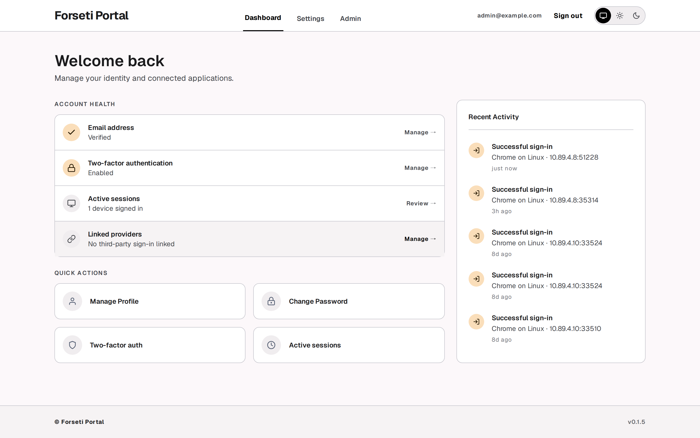
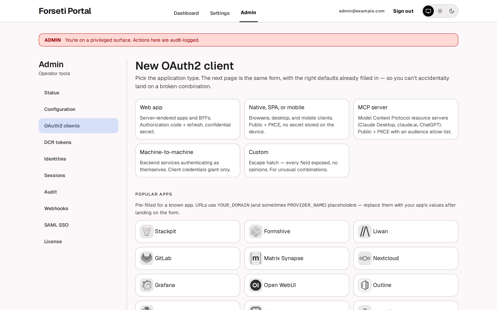
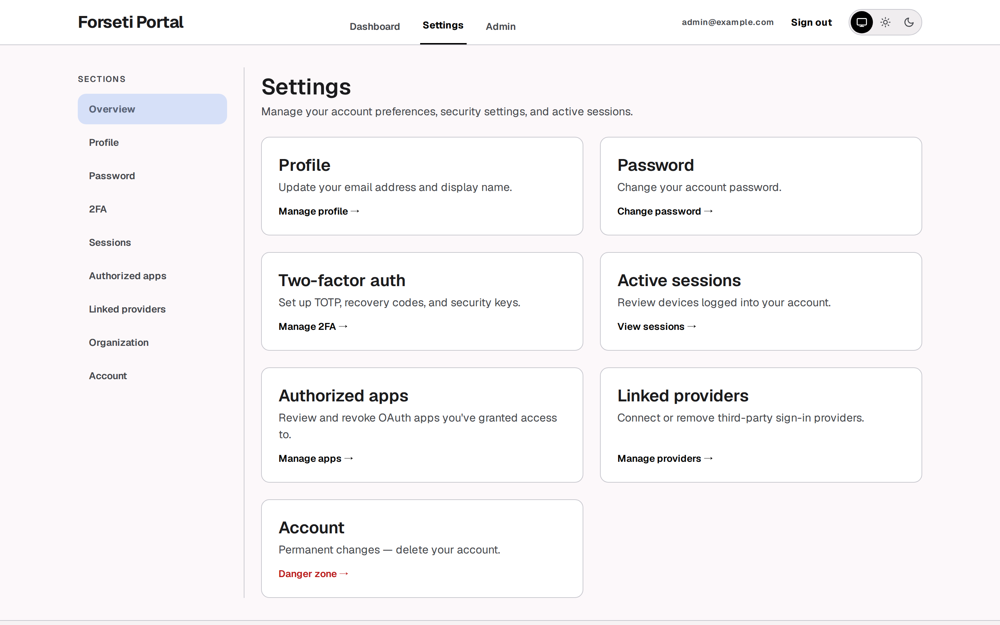

<div align="center">
  

  # Forseti

  **The web UI Ory doesn't ship.** Every self-service identity flow for [Ory Kratos](https://www.ory.sh/kratos/) and [Ory Hydra](https://www.ory.sh/hydra/) — login, registration, recovery, MFA, OAuth2 consent — plus an admin console, in a single server-rendered binary.

  [](https://github.com/franzos/forseti/actions/workflows/ci.yml)
  [](https://github.com/franzos/forseti/actions/workflows/release.yml)
  [](LICENSE)
  [](https://github.com/franzos/forseti/pkgs/container/forseti)

</div>

Ory's engines are excellent, but headless — you get APIs, your users need pages. Forseti is the missing frontend: one binary that talks to Kratos (identity) and Hydra (OAuth2/OIDC) and gives your users real screens for every flow, plus an admin surface for operators.

<p align="center">
  
  
  
</p>

## What you get

| | |
| --- | --- |
| 🔐 **Every Kratos flow, server-rendered** | Login, registration, recovery, verification, and the full settings hub — profile, password, MFA/TOTP, passkeys, social logins, active sessions. |
| 🪪 **OAuth2 / OIDC bridge** | Login, consent, and logout screens for Hydra's authorization-code flow — turn Forseti into a drop-in OIDC provider for your own apps. |
| 🧩 **40+ app templates** | One-click, pre-filled OAuth2 client setup for popular self-hosted apps (GitLab, Nextcloud, Vaultwarden, Grafana, Immich, …) — redirect URIs and per-app OIDC quirks already filled in. [Full list →](docs/operator-guide.md#app-templates) |
| 🛠️ **Admin console** | Manage identities, sessions, and OAuth2 clients; append-only audit log; live status dashboard; dynamic-client-registration tokens. |
| 🏢 **Organizations** | Multi-tenant orgs with members, invites, per-org branding, and per-org OIDC claims. |
| 🌗 **Light & dark** | A built-in theme toggle (light / dark / follow-system) across every page. |
| 🛡️ **Production-minded** | CSRF on every form, signed cookies, rate-limited DCR, and an account-deletion webhook saga with retries. |

## Quickstart

Prebuilt binaries for x86_64 and aarch64 Linux (glibc) are attached to every [release](https://github.com/franzos/forseti/releases/latest):

```bash
# binary + the static/ assets it serves
curl -L -o forseti.tar.gz https://github.com/franzos/forseti/releases/latest/download/forseti-x86_64-unknown-linux-gnu.tar.gz
tar -xzf forseti.tar.gz
cd forseti-x86_64-unknown-linux-gnu
cp config.example.toml config.toml   # then edit it
./forseti
```

Or pull the [container image](https://github.com/franzos/forseti/pkgs/container/forseti) from the GitHub Container Registry:

```bash
podman pull ghcr.io/franzos/forseti:latest
podman run --rm -p 3000:3000 \
  -v ./config.toml:/app/config.toml:ro \
  ghcr.io/franzos/forseti:latest
```

Both need a reachable Kratos and Hydra — see the [operator guide](docs/operator-guide.md). The binary reads `./config.toml` (override with `FORSETI_CONFIG_PATH`) and serves `./static` relative to its working directory.

> **Runtime note:** the binary links dynamically against `libpq` (the Postgres client). On a bare host install `libpq5` (Debian/Ubuntu) or `libpq` (most other distros); the container image already includes it. SQLite is bundled, so it needs nothing extra.

## Status

**Pre-release / active development.** Core flows work end-to-end against the Ory playground; APIs, config, and schema are still moving. Pin a commit if you build on it.

## Build from source

```bash
# 1. Bring up the playground (Kratos, Hydra, Mailcrab, Postgres)
make stack-up

# 2. Seed a deterministic admin (password + TOTP)
make seed-admin

# 3. Run Forseti (debug build) at :3000
make run
```

Open <http://localhost:3000>. Register at `/registration`, grab the verification email from Mailcrab at <http://127.0.0.1:4436>, and you're in.

For the full OAuth2 dance — register a Hydra client, run an auth-code flow, exchange a token — see [`.claude/skills/ory-up/SKILL.md`](.claude/skills/ory-up/SKILL.md) or the [integration guide](docs/integration-guide.md).

## How it fits together

```
      Browser
         |
         v
+------------------+        admin (server-only)
|     Forseti      | --------------------------------+
|   Rust / Axum    |                                 |
|       :3000      | --+                             |
+------------------+   |                             |
         |             |                             |
         | browser     | browser                     |
         |             |                             v
   +------------+ +------------+             | Kratos admin   |
   |  Kratos    | |   Hydra    |             | Hydra admin    |
   |  public    | |  public    |             | (internal only)|
   +------------+ +------------+             +-----------------+
         |             |
         +------+------+
                |
                v
         +--------------+
         |  Database    |
         | Postgres /   |
         |   SQLite     |
         +--------------+
```

## Documentation

- [Operator guide](docs/operator-guide.md) — deployment topology, Kratos/Hydra config, secrets, backups
- [Operator guide — reverse proxy](docs/operator-guide-proxy.md) — proxy topology, cookies, CSRF, CORS
- [Integration guide](docs/integration-guide.md) — consuming Forseti as an OIDC provider
- [Commercial features](docs/commercial/) — licensing model, plus the [Organizations](docs/commercial/organizations.md) and [Enterprise SAML SSO](docs/commercial/saml.md) guides

## License

Forseti is dual-licensed:

- **AGPL-3.0** for the open-source core (everything outside `src/commercial/`)
- **Commercial license** for paid features in `src/commercial/`

Built on [Ory Kratos](https://www.ory.sh/kratos/) and [Ory Hydra](https://www.ory.sh/hydra/).

---

Forseti — named for the Norse god of justice and reconciliation.
