# Application Flows

This document covers every user- and admin-facing flow in Forseti. Forseti is a thin Rust/Askama UI in front of [Ory Kratos](https://www.ory.sh/kratos/) (identity, sessions, recovery, verification, 2FA) and [Ory Hydra](https://www.ory.sh/hydra/) (OAuth2/OIDC). Most server-side state lives in Ory — Forseti renders, forwards cookies, and resolves challenges.

Diagrams are [Mermaid](https://mermaid.js.org/) sequence diagrams. Code references use `file:line` form against the current `master` tree.

---

## Authentication Flows

All user-facing auth flows are server-rendered by Forseti but driven by Kratos. Forseti never holds credentials — it forwards the browser's `Cookie` header to Kratos, fetches the flow JSON, projects it into Askama view-models (`group_nodes`, `InputView`, `ScriptView` in `src/flow_view.rs`), and renders a form whose `action` points directly back at Kratos's public API. Submissions go browser → Kratos; Kratos sets/clears the session cookie and 303s back to Forseti's `ui_url` for the next step.

Kratos returns 404/410 when a flow ID is unknown or expired and 403 when a settings flow needs a privileged re-auth. Both are surfaced as `FlowFetch::Gone` / `FlowFetch::PrivilegedRequired` (`src/ory/mod.rs:101`) and trigger a clean restart — handlers redirect the browser back to Kratos's `/self-service/<kind>/browser` init endpoint, preserving `return_to` / `aal` / `refresh`.

Forseti's own CSRF (a double-submit cookie token, `src/csrf.rs`) only protects Forseti-owned POST endpoints (`/logout`, settings revocation, oauth consent submit). Kratos forms carry their own `_csrf` hidden input rendered straight from the flow JSON — Kratos validates it itself.

### Registration

`GET /registration` — `registration` handler at `src/auth/registration.rs:33`.

If the user already has a session, the handler short-circuits to `safe_return_to(query.return_to, "/")` (`src/web.rs:41`). Otherwise:

- No `?flow=` → 302 to `<kratos_public>/self-service/registration/browser?return_to=...` (`browser_init_url`, `src/ory/kratos.rs:109`). Kratos creates the flow, sets the continuity cookie, and 303s back to `/registration?flow=<id>`.
- `?flow=<id>` present → fetch the flow JSON (`get_flow`, `src/ory/kratos.rs:46`) and render `templates/registration.html` via `render_registration` (`src/auth/registration.rs:76`).

The template renders a single form whose `action` is Kratos's `<kratos_public>/self-service/registration?flow=<id>` (extracted by `form_target` at `src/flow_view.rs:472`). Kratos's `selfservice.flows.registration.after.<method>.hooks: [session]` (`infra/kratos/kratos.yml`) auto-logs the new identity in for every method, so the browser lands on `/` immediately after a successful submit. Each method also ships a `web_hook` that fires Forseti's `/internal/audit/kratos?action=identity.created` receiver (on the internal listener — `[internal].bind`, defaults to `127.0.0.1:8081`) to record the event in the audit log. Default-org auto-join happens lazily on the user's first authenticated request — see "Auto-join on first authenticated request" below.

Kratos's progressive-registration mode means the form shape depends on which step the user is at — the first POST returns the same flow with additional method groups (password, passkey, webauthn). The template handles both shapes via `group_nodes`.

#### Password registration

Profile fields (`traits.email`, `traits.name.first`, `traits.name.last`) come back in the `default` group; the password input + submit live in the `password` group. The template renders them as one combined form (`templates/registration.html:31-72`).

#### Passkey / WebAuthn registration

If Kratos's `passkey` or `webauthn` method is enabled (it is — `infra/kratos/kratos.yml:41-57`), the flow JSON includes a `<script>` node pointing at `<kratos_public>/.well-known/ory/webauthn.js`. Forseti collects those via `collect_script_nodes(flow, "webauthn"|"passkey")` (`src/flow_view.rs:241`) and renders them verbatim, then includes `templates/partials/webauthn_helper.html` which:

1. Detects missing platform authenticators and disables passkey buttons with an inline note.
2. Surfaces `DOMException`s from Kratos's script into a visible banner above the form (Kratos's `webauthn.js` swallows them into `console.error`).

The trigger button's `onclick` comes straight from Kratos (`InputView::onclick`, `src/flow_view.rs:12`) — either a legacy literal JS string or the `onclickTrigger` enum mapped to `window.<name>(event)`.

#### OIDC / social registration

The Kratos config ships OIDC providers commented out (`infra/kratos/kratos.yml:60-90`) — no real credentials in the playground. When enabled, providers surface as `groups.oidc` and the template renders one button per provider beneath an "Or continue with" divider (`templates/registration.html:75-86`). Submitting redirects the browser through Kratos's OAuth dance with the upstream IdP; the same `session` hook auto-logs the resulting identity in.

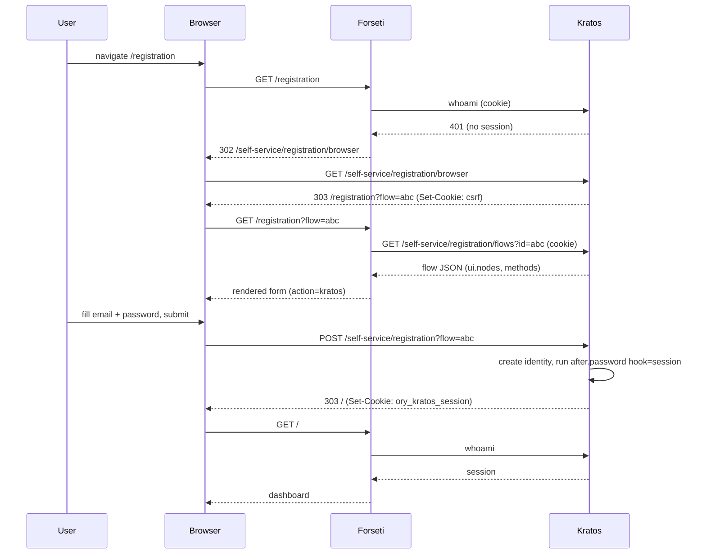
```mermaid
sequenceDiagram
    participant U as User
    participant B as Browser
    participant P as Forseti
    participant K as Kratos

    U->>B: navigate /registration
    B->>P: GET /registration
    P->>K: whoami (cookie)
    K-->>P: 401 (no session)
    P-->>B: 302 /self-service/registration/browser
    B->>K: GET /self-service/registration/browser
    K-->>B: 303 /registration?flow=abc (Set-Cookie: csrf)
    B->>P: GET /registration?flow=abc
    P->>K: GET /self-service/registration/flows?id=abc (cookie)
    K-->>P: flow JSON (ui.nodes, methods)
    P-->>B: rendered form (action=kratos)
    U->>B: fill email + password, submit
    B->>K: POST /self-service/registration?flow=abc
    K->>K: create identity, run after.password hook=session
    K-->>B: 303 / (Set-Cookie: ory_kratos_session)
    B->>P: GET /
    P->>K: whoami
    K-->>P: session
    P-->>B: dashboard
```

Edge cases:

- Validation errors (password too short, email taken) come back on the same flow with `messages` on individual nodes; rendered inline beside each input.
- Expired flow (10m, `infra/kratos/kratos.yml:119`) → `FlowFetch::Gone` → restart redirect.
- Unverified email after registration: the `session` hook lets the user in regardless, but `session_needs_verification` (`src/flow_view.rs:523`) drives a banner on the dashboard pointing at `/verification`.
- CSRF violation on submit → Kratos redirects to `/error?id=<error_id>` (`flows.error.ui_url`, `infra/kratos/kratos.yml:93-94`), handled by `error_page` (`src/auth/error.rs:36`).

### Login

`GET /login` — `login` handler at `src/auth/login.rs:42`.

The handler accepts three meaningful query params: `flow`, `return_to`, `aal`, `refresh`. The short-circuit in `login` skips the rest if the user already has a session, except in two carve-outs:

1. `aal=aal2` requested but the current session is at `aal1` (step-up demanded by an OAuth client's `acr_values`). Without this carve-out the user would loop between `/oauth/login` and `/login`.
2. `refresh=true` (privileged-session re-auth bouncing back from `/settings/password` or similar). Without this the user would livelock at `privileged_session_max_age`.

Both fall through to `browser_init_url_with` (`src/ory/kratos.rs:117`) so Kratos starts a flow that demands the appropriate credential.

Render path matches registration: render `templates/login.html` via `render_login` (`src/auth/login.rs:123`). The flow JSON's `action` URL points at `<kratos_public>/self-service/login?flow=<id>` and the form submits directly.

Kratos's `selfservice.flows.login.after.{password,passkey}.hooks` (`infra/kratos/kratos.yml`) fires Forseti's `/internal/audit/kratos?action=auth.login` receiver (on the internal listener — `[internal].bind`, defaults to `127.0.0.1:8081`) on successful primary-credential auth. AAL2 step-up methods (`totp`, `lookup_secret`, `webauthn`) intentionally don't fire — they're an upgrade on an existing session, not a fresh sign-in.

#### Password login

`groups.default` carries the `identifier` (email) input and the hidden CSRF token; `groups.password` carries the password field + submit. A "Forgot password?" link to `/recovery` is hand-rendered next to the password label (`templates/login.html:81`).

#### Passkey / WebAuthn login

Same shape as registration — the flow JSON contains the helper script node plus a trigger button whose `onclick` calls `window.oryPasskeyLogin(event)` / `window.oryWebAuthnLogin(event)`. The platform-credential check in `webauthn_helper.html` runs before the user can hit a broken button on a device without a platform authenticator.

#### OIDC login

Same `groups.oidc` rendering as registration. Clicking a provider button POSTs to Kratos which redirects to the upstream IdP and back.

#### Code-method login

`infra/kratos/kratos.yml:31-34` has `code` enabled, so the login flow can offer a "send me a magic link" shortcut as a single submit button in `groups.code` (rendered at `templates/login.html:39-41`). Kratos handles the email + return roundtrip; Forseti just renders whatever's in the flow.

#### 2FA / AAL2 step-up

When an OAuth client requests `acr_values=aal2` (handled in `oauth_login`, `src/oauth/login.rs:22` — out of scope for this section), or when something else demands a stronger session, the user lands on `/login?aal=aal2&return_to=...`. The handler forces Kratos to issue a fresh login flow with `aal=aal2` in the init URL (`src/ory/kratos.rs:117`). Kratos then renders TOTP / lookup_secret / webauthn nodes in `groups.other` (no dedicated group slot — they fall through `group_nodes` at `src/flow_view.rs:189`). The template's `groups.other` branch (`templates/login.html:99-117`) renders these generically.

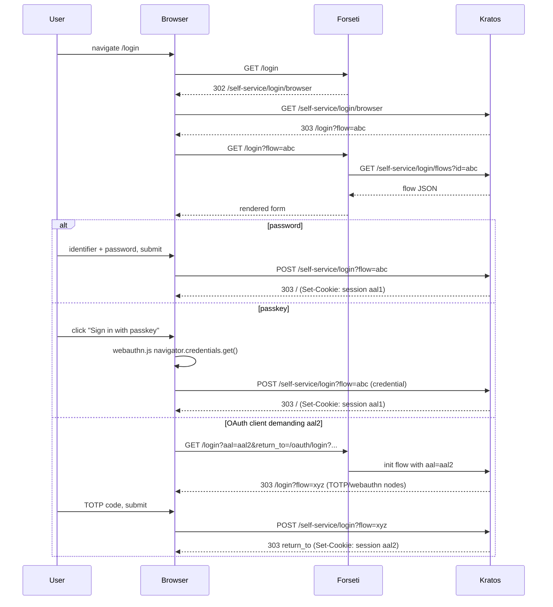
```mermaid
sequenceDiagram
    participant U as User
    participant B as Browser
    participant P as Forseti
    participant K as Kratos

    U->>B: navigate /login
    B->>P: GET /login
    P-->>B: 302 /self-service/login/browser
    B->>K: GET /self-service/login/browser
    K-->>B: 303 /login?flow=abc
    B->>P: GET /login?flow=abc
    P->>K: GET /self-service/login/flows?id=abc
    K-->>P: flow JSON
    P-->>B: rendered form

    alt password
        U->>B: identifier + password, submit
        B->>K: POST /self-service/login?flow=abc
        K-->>B: 303 / (Set-Cookie: session aal1)
    else passkey
        U->>B: click "Sign in with passkey"
        B->>B: webauthn.js navigator.credentials.get()
        B->>K: POST /self-service/login?flow=abc (credential)
        K-->>B: 303 / (Set-Cookie: session aal1)
    else OAuth client demanding aal2
        B->>P: GET /login?aal=aal2&return_to=/oauth/login?...
        P->>K: init flow with aal=aal2
        K-->>B: 303 /login?flow=xyz (TOTP/webauthn nodes)
        U->>B: TOTP code, submit
        B->>K: POST /self-service/login?flow=xyz
        K-->>B: 303 return_to (Set-Cookie: session aal2)
    end
```

Edge cases:

- Already-signed-in + plain `/login` → redirect to `safe_return_to` (`src/web.rs:41`). `safe_return_to` rejects scheme-relative URLs, embedded backslashes, and any absolute URL whose origin doesn't match `cfg.self_.url` — open-redirect defence.
- Flow expired (10m, `infra/kratos/kratos.yml:116`) → `FlowFetch::Gone` → restart.
- Wrong password → flow re-renders with `messages` on the password node.
- Account doesn't exist → Kratos returns a generic "credentials invalid" message on `flow_messages` (no user enumeration).

### Recovery (Password Reset)

`GET /recovery` — `recovery` handler at `src/auth/recovery.rs:30`.

No session check — recovery is for users who can't sign in. The handler is a thin wrapper around `get_flow` / `browser_init_url`, rendering `templates/recovery.html` via `render_recovery` (`src/auth/recovery.rs:68`).

Two visible flow states drive the template (`templates/recovery.html:5-12`):

- `choose_method` — initial email input.
- `sent_email` — code input + "we sent a code to your inbox" notice.

Kratos's playground SMTP target is Mailcrab (`infra/kratos/kratos.yml:167-169` — compose service named `mailslurper` for backwards compatibility, actually runs `marlonb/mailcrab`), so dev mail lands there.

After a correct code submission, Kratos creates a privileged session and **redirects the browser to `/settings?flow=<settings_flow_id>`** (the recovery-after-password hook). That's where the handoff begins.

#### Settings handoff after recovery

`settings_hub` at `src/settings/mod.rs:70` is the landing target. It inspects the flow's `request_url` via `settings_section_from_flow` (`src/settings/mod.rs:198`); when the URL contains `/self-service/recovery` (or `internal_context.recovery_link_token` is present), the section resolves to `password` and the user is forwarded to `/settings/password?flow=<id>`.

`render_settings` (`src/settings/mod.rs:357`) checks `is_recovery_handoff` (`src/settings/mod.rs:167`) and, when true, renders `templates/settings_password_handoff.html` instead of the usual settings layout. That template is intentionally chrome-less — no top nav, no sidebar — and shows a live countdown of Kratos's `privileged_session_max_age` (15m, `infra/kratos/kratos.yml:98`) computed via `privileged_deadline_rfc3339` (`src/settings/mod.rs:191`). The escape hatch is a single "Sign out without changing" button that POSTs to `/logout`.

The handoff template strictly belongs to the recovery flow even though it lives under `templates/settings_*` — it bridges a successful `/recovery` into a forced password change, and is the only `/settings/*` view rendered without authentication chrome.

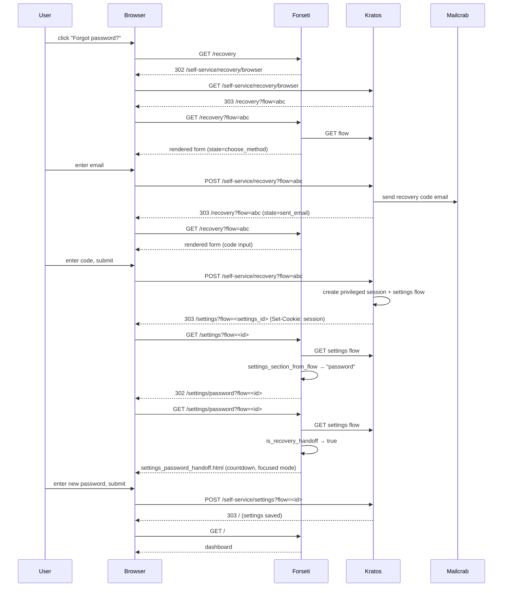
```mermaid
sequenceDiagram
    participant U as User
    participant B as Browser
    participant P as Forseti
    participant K as Kratos
    participant M as Mailcrab

    U->>B: click "Forgot password?"
    B->>P: GET /recovery
    P-->>B: 302 /self-service/recovery/browser
    B->>K: GET /self-service/recovery/browser
    K-->>B: 303 /recovery?flow=abc
    B->>P: GET /recovery?flow=abc
    P->>K: GET flow
    P-->>B: rendered form (state=choose_method)
    U->>B: enter email
    B->>K: POST /self-service/recovery?flow=abc
    K->>M: send recovery code email
    K-->>B: 303 /recovery?flow=abc (state=sent_email)
    B->>P: GET /recovery?flow=abc
    P-->>B: rendered form (code input)
    U->>B: enter code, submit
    B->>K: POST /self-service/recovery?flow=abc
    K->>K: create privileged session + settings flow
    K-->>B: 303 /settings?flow=<settings_id> (Set-Cookie: session)
    B->>P: GET /settings?flow=<id>
    P->>K: GET settings flow
    P->>P: settings_section_from_flow → "password"
    P-->>B: 302 /settings/password?flow=<id>
    B->>P: GET /settings/password?flow=<id>
    P->>K: GET settings flow
    P->>P: is_recovery_handoff → true
    P-->>B: settings_password_handoff.html (countdown, focused mode)
    U->>B: enter new password, submit
    B->>K: POST /self-service/settings?flow=<id>
    K-->>B: 303 / (settings saved)
    B->>P: GET /
    P-->>B: dashboard
```

Edge cases:

- Expired code → `flow_messages` carries the error; user can request a new code.
- Privileged window lapses before the user submits the new password → JS replaces the countdown with "Your recovery window expired. Start again" linking to `/recovery` (`templates/settings_password_handoff.html:94-100`).
- `/recovery` accessed by an already-signed-in user → no short-circuit; Kratos handles re-auth itself.
- Admin-issued recovery codes: operators can mint a one-shot code via the admin UI (`admin_create_recovery_code`, `src/ory/kratos.rs:367`) and hand it over out-of-band — same `/recovery` flow, code path only.

### Email Verification

`GET /verification` — `verification` handler at `src/auth/verification.rs:30`.

Same shape as recovery — wrapper around `get_flow` / `browser_init_url`. Renders `templates/verification.html` via `render_verification` (`src/auth/verification.rs:68`).

Three template states (`templates/verification.html:5-15`):

- `choose_method` — email input. Skipped for logged-in users (see below).
- `sent_email` — code input.
- `passed_challenge` — success message.

**Logged-in short-circuit.** The handler does an optional `whoami` (`src/auth/verification.rs:43`). When the request carries a valid session and the flow is sitting at `choose_method` with an unverified address on that identity, Forseti POSTs `method=code` + the session email + the flow's CSRF token to Kratos's `ui.action` server-side (`submit_email_method`, `src/auth/verification.rs:138`), then bounces the browser back to the same flow ID — by then Kratos has transitioned the flow to `sent_email` and the user lands directly on the code-entry screen. Failure (transport, CSRF mismatch, etc.) falls through to the regular template render, so the worst-case UX is the form they'd see today. The footer's back link follows the same signal: `is_logged_in` switches "Back to sign in" → "Back to dashboard".

Verification is **not enforced** at sign-in time (`infra/kratos/kratos.yml:122-128`). The playground deliberately uses a soft prompt: `session_needs_verification` (`src/flow_view.rs:540`) returns true while any of the identity's `verifiable_addresses` has `verified=false`. The dashboard renders a banner that links to `/verification`, and the profile page (`templates/settings_profile.html`) surfaces a "Not verified · Send verification email →" hint below the email field via the `email_verified` flag on `SettingsProfileTemplate`. Operators who need hard enforcement (banks, healthcare) can add `{ hook: show_verification_ui }` to each registration method.

Kratos's verification config has `after.default_browser_return_url: /` (`infra/kratos/kratos.yml:107-108`), so a successful submission lands the user back on the dashboard.

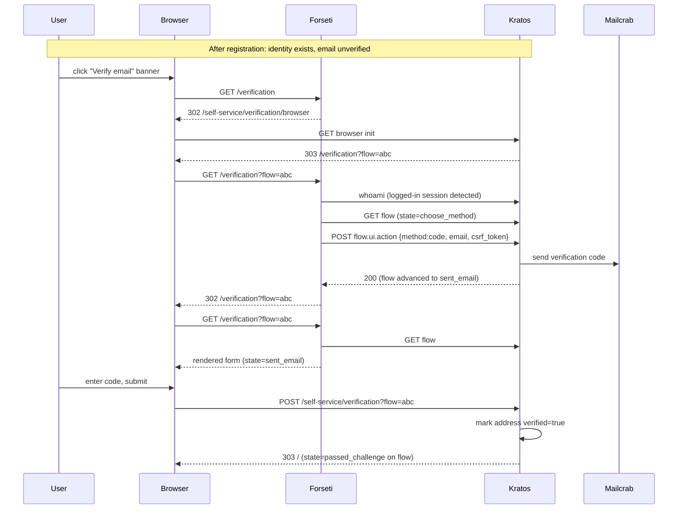
```mermaid
sequenceDiagram
    participant U as User
    participant B as Browser
    participant P as Forseti
    participant K as Kratos
    participant M as Mailcrab

    Note over U,K: After registration: identity exists, email unverified
    U->>B: click "Verify email" banner
    B->>P: GET /verification
    P-->>B: 302 /self-service/verification/browser
    B->>K: GET browser init
    K-->>B: 303 /verification?flow=abc
    B->>P: GET /verification?flow=abc
    P->>K: whoami (logged-in session detected)
    P->>K: GET flow (state=choose_method)
    P->>K: POST flow.ui.action {method:code, email, csrf_token}
    K->>M: send verification code
    K-->>P: 200 (flow advanced to sent_email)
    P-->>B: 302 /verification?flow=abc
    B->>P: GET /verification?flow=abc
    P->>K: GET flow
    P-->>B: rendered form (state=sent_email)
    U->>B: enter code, submit
    B->>K: POST /self-service/verification?flow=abc
    K->>K: mark address verified=true
    K-->>B: 303 / (state=passed_challenge on flow)
```

Edge cases:

- Magic link clicked from email → Kratos handles the GET directly and bounces the browser to `/verification?flow=<id>` already in `passed_challenge` state.
- Expired link → `/error?id=<error_id>`, handled by `error_page`. `extract_error_strings` (`src/auth/error.rs:80`) maps `self_service_flow_expired` → "Link expired".
- Reused link → same expired-link path (Kratos's flow.error.ui_url).

### Logout

`POST /logout` — `logout` handler at `src/auth/logout.rs:26`. POST-only on purpose so link prefetchers, scanners, and pasted URLs cannot terminate a session.

Steps:

1. Verify Forseti's own double-submit CSRF token (`csrf::verify_csrf`, `src/csrf.rs`). 403 on mismatch.
2. Forward the cookies to Kratos's `/self-service/logout/browser` (`fetch_logout_url`, `src/ory/kratos.rs:453`). Kratos returns `{ logout_url: "...&logout_token=..." }` — the URL embeds a single-use token.
3. 302 the browser to that URL. Kratos clears the `ory_kratos_session` cookie and 303s to `selfservice.flows.logout.after.default_browser_return_url` (= `/login`, `infra/kratos/kratos.yml:110-112`).

If Kratos is unreachable the handler still redirects to `/login` so the user sees *something* — their session cookie stays intact, they can retry.

This is the Kratos session logout. OAuth client logout (RP-initiated, Hydra) is handled by `/oauth/logout` (`src/oauth/logout.rs:38`) and is out of scope here.

```mermaid
sequenceDiagram
    participant U as User
    participant B as Browser
    participant P as Forseti
    participant K as Kratos

    U->>B: click "Sign out"
    B->>P: POST /logout (cookie, _csrf)
    P->>P: verify_csrf
    P->>K: GET /self-service/logout/browser (cookie)
    K-->>P: { logout_url: "...&token=xyz" }
    P-->>B: 302 <logout_url>
    B->>K: GET <logout_url>
    K-->>B: 303 /login (Set-Cookie: ory_kratos_session=; Max-Age=0)
    B->>P: GET /login
    P-->>B: rendered login flow
```

Edge cases:

- CSRF mismatch → 403 "CSRF check failed".
- No session cookie on request → `fetch_logout_url` returns `Ok(None)` (handles the 401/403 from Kratos), handler redirects to `/login`.
- The "Sign out without changing" button in the recovery handoff template POSTs to `/logout` with the same CSRF token — same path.

---

## Settings & Account Management Flows

All `/settings/*` paths require a Kratos session — `whoami` is the first thing
every handler does, and an empty result redirects to `/login?return_to=<path>`.
The settings sub-pages (except `/settings/sessions` and `/settings/linked-providers`'s
revoke endpoints) are powered by Kratos *settings flows*: a server-side
state object identified by a `flow` query parameter. Kratos's
`selfservice.flows.settings.ui_url` is configured to `/settings`, so any
flow Kratos itself initialises lands there first.

Common machinery lives in `src/settings/mod.rs:277` (`fetch_settings_subpage`) and is
shared by Profile, Password, 2FA, and Linked Providers. It enforces three
behaviours uniformly:

- No `flow` query param → redirect to Kratos's browser-init URL with
  `return_to` pointing back at this same sub-page so Kratos drops a fresh
  flow and bounces the user home.
- Flow is `Gone` → re-init (same redirect dance).
- Flow demands a privileged session (`session_refresh_required`) → redirect
  to `/login?refresh=true&return_to=<sub-page>`. Kratos re-auths the existing
  session and ships them back. The privileged window is 15 minutes
  (`privileged_session_max_age`).

CSRF cookies are issued via `csrf::ensure_csrf_cookie` on every render and
verified on every POST handler defined in this app (Kratos handles its own
CSRF for the flow form itself, since the form action is Kratos's public URL).

### Settings overview

`GET /settings` — handler `settings_hub` (`src/settings/mod.rs:70`). Two modes:

1. **Hub mode** (no `flow` param): renders `templates/settings.html`, a tiled
   landing page with cards for Profile, Password, 2FA, Active Sessions,
   Linked Providers.
2. **Routing mode** (`?flow=<id>`): Kratos always lands its settings flow on
   `/settings`. The handler calls `get_flow` and inspects `request_url` to
   work out which sub-page the user was actually heading to
   (`settings_section_from_flow`, `src/settings/mod.rs:198`), then 302s to
   `/settings/<section>?flow=<id>`. Fallback target is `/settings/profile`
   for flows we can't classify.

Recovery hand-offs go through routing mode: the recovery flow's
`request_url` carries `/self-service/recovery/...`, so the section resolver
funnels them to `/settings/password` (see the handoff flow below).

### Profile

`GET /settings/profile` — handler `settings_profile` (`src/settings/profile.rs:28`),
template `templates/settings_profile.html`.

Renders the `profile` node group of the Kratos settings flow (traits — email,
display name, anything from the identity schema). Form action posts directly
to Kratos's public `/self-service/settings?flow=<id>` endpoint; Kratos
re-renders or completes server-side. On success Kratos re-issues the same
flow with a "Your changes have been saved" message and stays on the same UI URL.

Ory calls (via `fetch_settings_subpage`):

- `kratos::whoami` (`src/ory/kratos.rs:12`)
- `kratos::browser_init_url` for `FlowKind::Settings` (`src/ory/kratos.rs:109`) when
  no flow ID is present
- `kratos::get_flow` (`src/ory/kratos.rs:46`)

### Password

`GET /settings/password` — handler `settings_password` (`src/settings/password.rs:50`),
template `templates/settings_password.html`. Same pattern as Profile, but
renders the `password` node group. Submitting hits Kratos directly; Kratos
enforces password policy (min length, breached-password check if configured)
and surfaces error messages through the flow's `ui.nodes[*].messages`.

Branch — **recovery hand-off** (`is_recovery_handoff`, `src/settings/mod.rs:167`):
when the settings flow was issued by Kratos's `recovery.after.password` hook
the renderer swaps in `templates/settings_password_handoff.html` instead.
This is a focused-mode card layout (no top nav, no settings sidebar) with a
live 15-minute countdown surfaced from the flow's `issued_at` +
`privileged_session_max_age`. On `state == "success"` we 303 to `/` rather
than staying on the settings UI (Kratos doesn't set
`after.password.default_browser_return_url`, so without this redirect the
user would sit on the handoff page after success). Detection signals
(any one suffices):

- `request_url` contains `/self-service/recovery`
- `internal_context` carries `recovery_link_token`, `RecoveryFlow`, or
  `recovery_flow`
- explicit `return_to=/settings/password` is treated as the regular settings path

Privileged-session refresh: changing a password requires a recent
authentication. If the flow comes back with `PrivilegedRequired` the user is
redirected to `/login?refresh=true&return_to=/settings/password`.

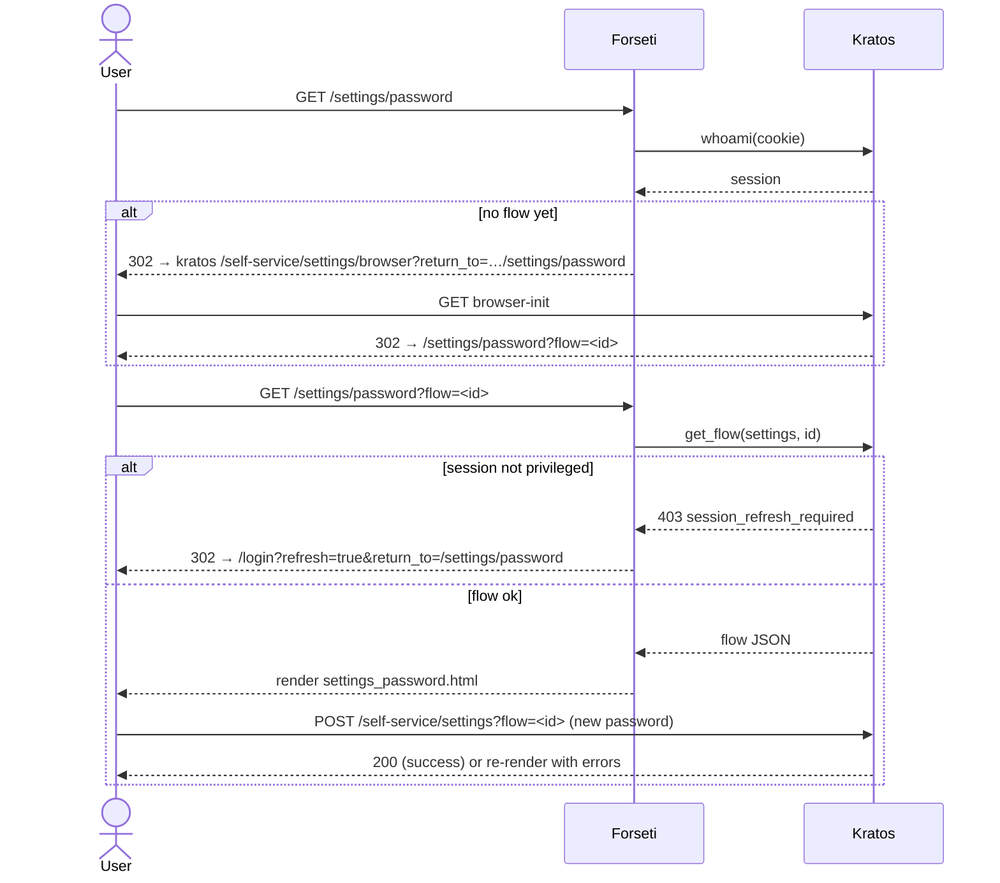
```mermaid
sequenceDiagram
    actor U as User
    participant P as Forseti
    participant K as Kratos
    U->>P: GET /settings/password
    P->>K: whoami(cookie)
    K-->>P: session
    alt no flow yet
        P-->>U: 302 → kratos /self-service/settings/browser?return_to=…/settings/password
        U->>K: GET browser-init
        K-->>U: 302 → /settings/password?flow=<id>
    end
    U->>P: GET /settings/password?flow=<id>
    P->>K: get_flow(settings, id)
    alt session not privileged
        K-->>P: 403 session_refresh_required
        P-->>U: 302 → /login?refresh=true&return_to=/settings/password
    else flow ok
        K-->>P: flow JSON
        P-->>U: render settings_password.html
        U->>K: POST /self-service/settings?flow=<id> (new password)
        K-->>U: 200 (success) or re-render with errors
    end
```

### Linked Providers (OIDC)

`GET /settings/linked-providers` — handler `settings_linked_providers`
(`src/settings/linked_providers.rs:37`), template `templates/settings_linked_providers.html`.

Renders the `oidc` node group of the settings flow. Each enabled provider
shows up as either a "Link" or an "Unlink" button (Kratos emits the right
one based on the identity's existing OIDC credentials). All buttons render
as secondary (outline) — no single provider is promoted to primary, since
there's no obvious "default" choice in this context.

Submission goes to Kratos. The link flow round-trips through the provider's
OAuth dance (Kratos redirects, the IdP sends the user back to Kratos, Kratos
issues a final 303 to the UI URL); the unlink flow is a single POST.

Same privileged-session and gone-flow handling as Profile/Password.

### Sessions

`GET /settings/sessions` — handler `settings_sessions` (`src/settings/sessions.rs:58`),
template `templates/settings_sessions.html`. **Does not use the Kratos
settings flow machinery** — it talks to Kratos's session APIs directly.

Renders one row per active session. Kratos's `/sessions` endpoint returns
*other* sessions only (the cookie used for the call identifies "this"
session and is excluded), so the handler synthesises a row for the current
session from `whoami` and stamps a "Current" badge on it
(`session_to_view`, `src/settings/sessions.rs:115`).

Ory calls:

- `kratos::whoami`
- `kratos::list_my_sessions` (`src/ory/kratos.rs:212`)

`POST /settings/sessions/{id}/revoke` — `settings_sessions_revoke`
(`src/settings/sessions.rs:152`). Verifies CSRF, re-checks the session, calls
`kratos::revoke_session` (`src/ory/kratos.rs:234`), and 303s back to the list with
a flash cookie set ("Session signed out." / "Could not sign out that
session.").

`POST /settings/sessions/revoke-others` — `settings_sessions_revoke_others`
(`src/settings/sessions.rs:188`). Calls `kratos::revoke_other_sessions`
(`src/ory/kratos.rs:248`) which returns the count of revoked sessions; flash
message reflects the number.

Flash messages are cookie-based one-shots (`flash::store_flash` /
`flash::take_flash`) scoped to the path.

### Authorized apps

`GET /settings/authorized-apps` — handler `settings_authorized_apps`
(`src/settings/authorized_apps.rs:58`), template
`templates/settings_authorized_apps.html`. Forseti-owned (no Kratos settings
flow); reads directly from Hydra.

Renders one row per OAuth2 client the user has granted access to. Hydra
returns one row per consent *session* (the user may have re-consented or
granted from multiple browser sessions); `collapse_sessions_to_apps`
(`src/settings/authorized_apps.rs:129`) folds them by `client_id`, keeping
the newest `handled_at` and the union of granted scopes. Each row shows the
client name, logo (or a placeholder), client URI, scope chips (using the
descriptions configured in `oauth.scope_descriptions`), the relative grant
timestamp, and a "Verified" badge when the client's `metadata.verified`
flag is set.

Ory calls:

- `kratos::whoami`
- `hydra::list_consent_sessions_by_subject` (`src/ory/hydra.rs:193`)

`POST /settings/authorized-apps/{client_id}/revoke` —
`settings_authorized_apps_revoke` (`src/settings/authorized_apps.rs:214`).
Verifies CSRF, re-checks the session, calls
`hydra::revoke_consent_sessions_for_client` (`src/ory/hydra.rs:242`) — which
hits Hydra's `revokeOAuth2ConsentSessions?subject=…&client=…&all=true` —
and 303s back to the list with a flash. Audited as
`action::OAUTH_CONSENT_REVOKED` (`src/audit/mod.rs:111`) with the client
ID as the target and `reason=settings_self_serve` in metadata.

**Hydra constraint:** revocation is per-client, not per-scope. The user
can't narrow a grant from this page — to drop a scope they revoke and let
the app re-prompt with the smaller scope set on next sign-in.

### 2FA / Passkeys

`GET /settings/2fa` — handler `settings_2fa` (`src/settings/two_factor.rs:73`), renderer
`render_2fa` (`src/settings/two_factor.rs:86`), template `templates/settings_2fa.html`.

A single settings flow aggregates three Kratos node groups; each renders as
its own card on the page:

- **TOTP** (`totp` group) — Kratos emits `totp_qr` (image data URL) +
  `totp_secret_key` + a `totp_code` confirm input on first enrolment. Post-
  enrolment those nodes are replaced by a `totp_unlink` submit. Detection:
  `totp_enrolled = group_has_node(flow, "totp", "totp_unlink")`.
- **Recovery codes** (`lookup_secret` group) — Kratos emits
  `lookup_secret_regenerate` / `lookup_secret_disable` / `lookup_secret_reveal`
  + a `lookup_secret_confirm` button. The single render-pass right after
  regeneration carries the plaintext codes via `lookup_codes(flow)`
  (`src/flow_view.rs:355`) — `lookup_just_regenerated` distinguishes this
  render-once state. Subsequent fetches drop the plaintext.
- **WebAuthn / Passkeys** (`webauthn` + `passkey` groups merged) — Kratos
  emits a `webauthn_register_displayname` text input and a `button`-typed
  trigger node that fires the WebAuthn JS via `onclickTrigger`. The flow
  also carries `script` nodes (Kratos's own JS helpers) which are dumped
  via `collect_script_nodes` and reattached to the page. Enrolment
  state is `webauthn_enabled = !webauthn_nodes.is_empty()`.

Primary CTA promotion (`promote_primary`, `src/settings/two_factor.rs:162`) keeps the
intent readable:

| Section | Primary | Secondary |
| --- | --- | --- |
| TOTP | `totp_code` (Verify) | `totp_unlink` |
| Lookup | `lookup_secret_confirm`, `lookup_secret_regenerate` | `lookup_secret_disable`, `lookup_secret_reveal` |
| WebAuthn | `webauthn_register_displayname` (Add key) | per-key unlink buttons |

All three sections submit to the same flow form action — Kratos disambiguates
on the `method` hidden field (`totp` / `lookup_secret` / `webauthn` /
`passkey`).

Privileged session required (same gate as `/settings/password`); same
gone/missing-flow init dance.

### Password handoff (recovery)

Already covered in [Password](#password). Recap: this is the focused-mode
variant of `/settings/password` rendered when the settings flow originated
from `/recovery`. Template
`templates/settings_password_handoff.html`. Key differences from the
regular password page:

- No top nav, no settings sidebar (the user is on a one-shot path).
- Live countdown driven by `privileged_deadline_rfc3339`
  (`src/settings/mod.rs:191`) reading `flow.issued_at + 15m`.
- A secondary "Sign out without changing" form posts to `/logout`.
- On `state == "success"` we 303 to `/` instead of re-rendering.

### Account self-deletion

Danger zone for the signed-in user — permanent identity removal plus a
signed webhook fan-out to every OAuth2 client that registered a
deletion endpoint. Handlers in `src/settings/account.rs`; saga state
in `src/webhook.rs`; the outbox is `webhook_outbox`. Payloads are
RFC 8417 Security Event Tokens signed EdDSA (Ed25519) by the Forseti-owned
key at `[webhook].signing_key_path` and published as JWKS at
`/.well-known/webhook-jwks.json`.

Direction is one-way: **Forseti → apps**. Apps can clear their local
copy of user data, but they can't initiate identity deletion — that's
gated to the user (or an operator via `/admin/identities`).

`GET /settings/account` — handler `settings_account`
(`src/settings/account.rs:60`), template `templates/settings_account.html`.
Just the danger-zone landing page; only requires an active Kratos
session.

`GET /settings/account/delete` — handler `settings_account_delete`
(`src/settings/account.rs:80`), template
`templates/settings_account_delete_confirm.html`. Gated behind
`fetch_settings_subpage` (same `?refresh=true` flow as
`/settings/password`) so landing here means the user has freshly
re-authenticated within the privileged window. Renders the list of
apps that will be notified — pulled from Hydra's consent sessions and
filtered by `client.metadata.forseti.account_deletion_url`.

`POST /settings/account/delete` — handler
`settings_account_delete_submit` (`src/settings/account.rs:106`). Saga:

```mermaid
sequenceDiagram
    autonumber
    participant User as User
    participant Forseti as Forseti
    participant DB as Forseti DB
    participant Kratos as Kratos
    participant Hydra as Hydra
    participant Worker as Webhook worker
    participant App as Downstream app

    User->>Forseti: POST /settings/account/delete (CSRF + confirm_email)
    Forseti->>Forseti: verify CSRF, privileged session, email match
    Forseti->>Hydra: list_consent_sessions_by_subject(user_id)
    alt Hydra reachable
        Hydra-->>Forseti: clients + metadata.forseti.account_deletion_url
    else Hydra unreachable
        Hydra--xPortal: error
        Forseti-->>User: error page; identity untouched, no outbox rows
    end
    Forseti->>DB: enqueue PENDING outbox row per (client, URL) with EdDSA-signed SET as payload
    Forseti->>Hydra: revoke_consent_sessions_for_subject(user_id) (best-effort)
    Forseti->>Kratos: admin_delete_identity(user_id)
    alt Kratos delete OK
        Forseti->>DB: PENDING → CONFIRMED for event_id
        Forseti->>DB: audit::log_critical(ACCOUNT_SELF_DELETED) (audit_fallback stderr on Err)
        Forseti-->>User: 303 /login?msg=account_deleted + Set-Cookie clearing ory_kratos_session
        Worker->>DB: drain CONFIRMED rows where next_attempt_at ≤ now
        Worker->>App: POST <url> with compact JWS body (application/secevent+jwt) + X-Forseti-Event header
        alt 2xx
            App-->>Worker: 200 OK
            Worker->>DB: delivered_at = now
        else failure
            App-->>Worker: 5xx / transport error
            Worker->>DB: attempts +=1, next_attempt_at = backoff(...)
            note over Worker,DB: After 12 attempts OR 72h: state = DEAD
        end
    else Kratos delete failed
        Forseti->>DB: PENDING → ABORTED for event_id
        Forseti-->>User: error page; identity still exists
    end
```

Key invariants (`TODO.md` §1):

- The worker only ever drains `CONFIRMED` rows. `PENDING` is invisible
  to it — guarantees no app is notified before Kratos has actually
  removed the identity.
- Crash window between writing PENDING rows and the Kratos delete is
  resolved by `webhook::reconcile_pending` at startup
  (`src/webhook.rs`): rows older than 5 minutes still in `PENDING`
  are reconciled against Kratos — if the identity is gone, flip to
  `CONFIRMED`; if it still exists, flip to `ABORTED`.
- The outbox `payload` column stores a compact JWS — an RFC 8417
  Security Event Token signed EdDSA (Ed25519, RFC 8037) by the
  Forseti-owned key loaded at boot
  (`webhook::SigningKey::load_or_generate`, `src/webhook.rs`).
  Claims follow Google's Cross-Account Protection / RISC
  convention: `iss` = Forseti self URL, `aud` = receiver client_id,
  `jti` = event_id UUID, and a single entry under `events` at the
  RISC URI
  `https://schemas.openid.net/secevent/risc/event-type/account-purged`
  carrying the deleted subject. Header `typ` is `secevent+jwt`
  per RFC 8417 §2.3 and `kid` is the deterministic
  `SHA-256(public_key_bytes)[..16]` so receivers' JWKS caches
  survive Forseti restarts.
- Receivers verify against the public JWK published at
  `GET /.well-known/webhook-jwks.json`
  (handler `webhook::jwks_endpoint`). Cache-Control is set to a
  day; with the deterministic `kid`, a Forseti restart doesn't
  invalidate any caches.
- Each delivery carries one Forseti-specific header,
  `X-Forseti-Event: <event_id>`, for body-less dedupe across
  retries. There's no separate transport-level signature — the
  JWS itself binds `iat` + `jti`, and the payload is signed once
  at enqueue time (not re-signed per retry).
- The worker's reqwest client has redirects disabled and a 10s
  request timeout. `account_deletion_url` is validated at admin
  save time to reject `http://`, loopback, link-local, RFC1918,
  IMDS, CGNAT, and unique-local IPv6 targets — defence in depth
  against SSRF through a confused-deputy admin action.
- Signing key rotation is operator-driven: drop a fresh PEM at
  `[webhook].signing_key_path` and restart. Because the public
  JWK shape is served from the Forseti-owned file, receivers'
  JWKS caches refetch on the next `kid` miss with no shared-
  secret-style coordination needed.
- Retry: `1m * 2^attempt` with ±25 % jitter, capped at 6 h. Max 12
  attempts or 72 h max age, whichever fires first → `DEAD`.
- Empty consent-grant set → no outbox writes; only the Kratos delete
  runs.
- Hydra `list_consent_sessions_by_subject` failure aborts the saga
  *before* the destructive call. Silently proceeding with an empty
  target list would destroy the Kratos identity while every integrator
  retained a stale copy with no notification — a compliance regression.
  The read-only confirm page (`list_apps_to_notify`) still degrades
  gracefully on the same Hydra failure since rendering an incomplete
  app list is harmless on the GET path.
- The `account.self_deleted` audit row uses `audit::log_critical`. On
  insert failure the row is emitted to stderr as a structured
  `audit_fallback` tracing event so compliance log scrapers can recover
  it. The Kratos identity is already destroyed at that point — `Err`
  cannot unwind the saga, but the additional log line makes the loss
  visible in the primary log stream beyond the fallback target.
- Success response clears the `ory_kratos_session` cookie via a
  `Set-Cookie: ory_kratos_session=; Path=/; HttpOnly; SameSite=Lax[;
  Secure]; Expires=Thu, 01 Jan 1970 00:00:00 GMT` header on the
  `/login?msg=account_deleted` redirect (`Secure` flag conditional on
  `self_.is_https()`). The past `Expires` mirrors `clear_flash_cookie`
  — fixed RFC 1123 string in the epoch, no `time` crate dep. Works in
  the path-prefixed single-host topology (recommended); in split-origin
  deployments the browser scopes Kratos's cookie to Kratos's origin and
  the header is a no-op (the stale cookie sticks until the next request
  to Kratos returns 401).

Admin observability:

- `/admin/webhooks` — `webhooks::show` (`src/admin/webhooks.rs:51`),
  template `templates/admin/webhooks.html`. Lists DEAD rows with
  per-row requeue (back to `CONFIRMED`, attempts=0) and discard
  (hard delete). POSTs to `/admin/webhooks/{id}/requeue` /
  `/admin/webhooks/{id}/discard`.
- `/admin/status` surfaces a count banner when `dead_webhook_count > 0`
  so operators see the problem even without opening `/admin/webhooks`.

### License activation

Forseti-owned settings page that activates a commercial-tier license blob signed by the offline `forseti-license` issuer. No Kratos flow involved — the license is per-installation, not per-identity.

`GET /settings/license` — handler `settings_license` (`src/commercial/settings_page.rs:71`), template `templates/commercial/license.html`. Renders the current `LicenseStatus` (Unlicensed / Active / Grace / Expired) plus the activation textarea. Grace state surfaces a yellow banner counting down to the hard-gate date; Expired surfaces a red banner.

`POST /settings/license/activate` — handler `activate` (`src/commercial/settings_page.rs:196`). Decodes the base64 blob, verifies the Ed25519 signature against `src/commercial/pubkey.bin`, classifies against the wall clock, upserts the singleton `forseti_license` row, and atomically swaps the in-memory `ArcSwap<LicenseStatus>` on `AppState`. Emits `audit::action::LICENSE_ACTIVATED` on success; verification failures log at `warn!` and surface a non-technical message via the flash cookie.

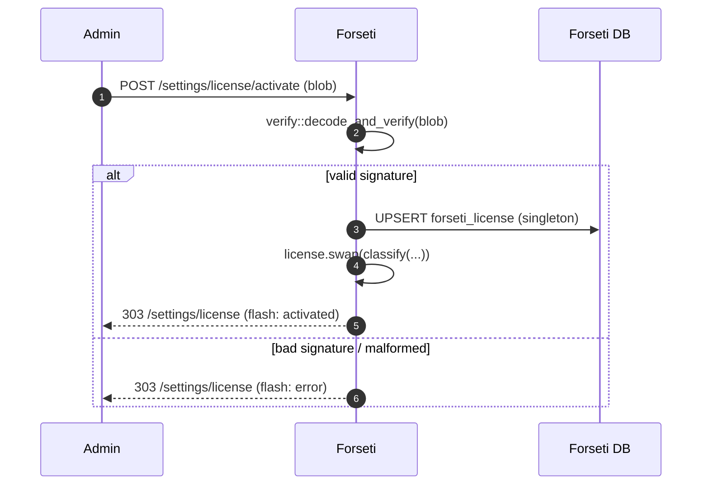
```mermaid
sequenceDiagram
    autonumber
    participant Admin
    participant Forseti
    participant DB as Forseti DB
    Admin->>Forseti: POST /settings/license/activate (blob)
    Forseti->>Forseti: verify::decode_and_verify(blob)
    alt valid signature
        Forseti->>DB: UPSERT forseti_license (singleton)
        Forseti->>Forseti: license.swap(classify(...))
        Forseti-->>Admin: 303 /settings/license (flash: activated)
    else bad signature / malformed
        Forseti-->>Admin: 303 /settings/license (flash: error)
    end
```

`POST /settings/license/deactivate` — handler `deactivate` (`src/commercial/settings_page.rs:265`). DELETEs the singleton row, swaps the handle back to `LicenseStatus::Unlicensed`, emits `audit::action::LICENSE_DEACTIVATED`.

**Gate at call sites**: `state.license.feature(Feature::Orgs)` returns `Allowed | GraceReadOnly | Locked`. Locked branches render `templates/commercial/upsell.html` via `commercial::upsell::render_upsell`. GraceReadOnly is the soft-gate signal — GET handlers can keep rendering, but POSTs that mutate gated state should refuse with the upsell page.

### RP-initiated account management (`/handoff`)

External OAuth clients deep-link users into settings surfaces via the `/handoff` bridge. Forseti validates the request, sets a signed cookie that drives the "Continuing from <App>" banner above the navigation, and 302s to the per-action settings route.

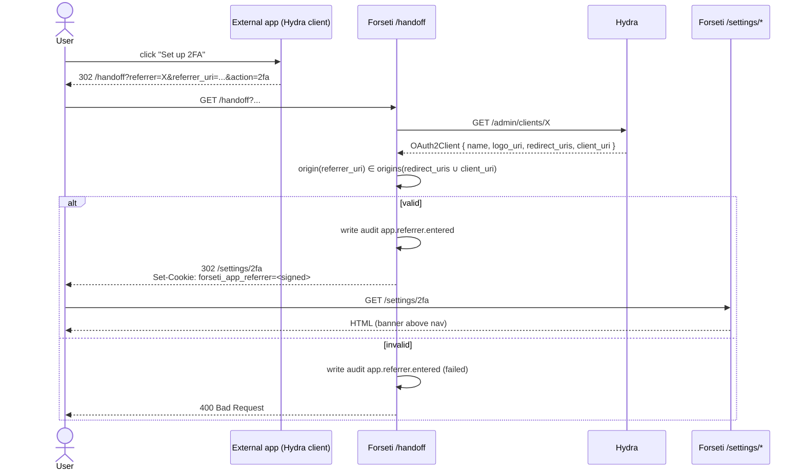
```mermaid
sequenceDiagram
    actor User
    participant App as External app (Hydra client)
    participant Forseti as Forseti /handoff
    participant Hydra
    participant Settings as Forseti /settings/*

    User->>App: click "Set up 2FA"
    App-->>User: 302 /handoff?referrer=X&referrer_uri=...&action=2fa
    User->>Forseti: GET /handoff?...
    Forseti->>Hydra: GET /admin/clients/X
    Hydra-->>Forseti: OAuth2Client { name, logo_uri, redirect_uris, client_uri }
    Forseti->>Forseti: origin(referrer_uri) ∈ origins(redirect_uris ∪ client_uri)
    alt valid
        Forseti->>Forseti: write audit app.referrer.entered
        Forseti-->>User: 302 /settings/2fa<br/>Set-Cookie: forseti_app_referrer=<signed>
        User->>Settings: GET /settings/2fa
        Settings-->>User: HTML (banner above nav)
    else invalid
        Forseti->>Forseti: write audit app.referrer.entered (failed)
        Forseti-->>User: 400 Bad Request
    end
```

`GET /handoff` — handler `handoff_enter` (`src/handoff/mod.rs`). Query params: `referrer` (Hydra `client_id`), `referrer_uri` (absolute URL), `action` (verb mapped to a path via the whitelist in `action_target`). Validates the client via `hydra::get_client` and origin-matches the URI against the client's `redirect_uris` and `client_uri`. Sets `forseti_app_referrer` (signed HMAC-SHA256, 1h TTL, deterministic key from `cfg.self_.url`) and 302s to the action target. Both referrer params are co-required; if neither is set, the endpoint acts as a stable deep-link target with no banner (useful for Forseti-internal emails).

`GET /handoff/return` — handler `handoff_return`. Reads the cookie's stored `referrer_uri`, clears the cookie, 302s to that URI. Writes `app.referrer.returned`. The "Return to <App>" anchor on the banner targets this.

`POST /handoff/dismiss` — handler `handoff_dismiss`. CSRF-protected. Clears the cookie globally and redirects to `return_to` (path-only, validated) or `/settings`. The "×" dismiss button.

**Action whitelist** (`action_target` in `src/handoff/mod.rs`):

| Verb | Route |
| ---- | ----- |
| `2fa`, `totp`, `mfa` | `/settings/2fa` |
| `password` | `/settings/password` |
| `profile` | `/settings/profile` |
| `sessions` | `/settings/sessions` |
| `linked_providers`, `linked-providers` | `/settings/linked-providers` |
| `authorized_apps`, `authorized-apps` | `/settings/authorized-apps` |
| missing / unknown | `/settings` |

Destructive surfaces (account deletion) are intentionally absent — users navigate there from inside Forseti's nav, not via external deep-links.

**Banner rendering**. The cookie payload is read by the `ReferrerBanner` axum extractor (`src/handoff/mod.rs`) and threaded into each settings template struct as `referrer_banner: Option<ReferrerBannerView>`. `templates/base.html` declares an empty `` above `<header>`; settings templates override the block with ``. Other templates (dashboard, admin, orgs) don't override the block — the cookie persists but the banner only paints on settings pages in v1.

**Trust model**. `referrer_uri` is origin-bound to the client's registered URIs at entry time. The banner's "Return" URL comes from the cookie (signed) — a tampered cookie value fails HMAC verification and the banner silently doesn't render. `client_name` and `logo_uri` are read from Hydra at entry, not from query params, so a malicious link can't spoof the brand. Cookie is HttpOnly + SameSite=Lax + Secure when Forseti is HTTPS.

**Validation failures** audit at `warning` severity with `failed_reason` set to `client_not_found` or `referrer_uri_origin_mismatch` — visible on `/admin/audit` so operators can spot misconfigured integrators.

## OAuth2 / Hydra Flows

Forseti acts as Hydra's login + consent UI. Hydra issues challenges
(`login_challenge`, `consent_challenge`, `logout_challenge`); Forseti
resolves them against the Kratos session and accepts/rejects them via
Hydra's admin API. The Hydra wrappers live in `src/ory/hydra.rs`.

### OAuth Login

`GET /oauth/login?login_challenge=...` — handler `oauth_login`
(`src/oauth/login.rs:22`). This is the first step of every OAuth2 authorization
request — Hydra redirects the user here once it's received the `/oauth2/auth`
call from the relying party.

Behaviour:

1. `hydra::get_login_request` to resolve the challenge.
2. `kratos::whoami` to read the current session.
3. No session → 302 to `/login?return_to=/oauth/login?login_challenge=...`
   so the user lands here again post-auth.
4. ACR step-up: if the challenge's `oidc_context.acr_values` contains
   `aal2` and the session's AAL is below that, 302 to
   `/login?aal=aal2&return_to=...`. Kratos demands a second factor and
   bounces the user back.
5. Otherwise: `hydra::accept_login_request` with `subject = identity.id`,
   `remember = true`, `amr` derived from
   `session.authentication_methods` (defaults to `["pwd"]` if missing),
   and `acr = session_aal`. Returns a redirect to either the consent
   endpoint or directly back to the RP (Hydra decides).

### Consent

`GET /oauth/consent?consent_challenge=...` — handler `oauth_consent`
(`src/oauth/consent.rs:50`), template `templates/consent.html`.

`POST /oauth/consent` — `oauth_consent_submit` (`src/oauth/consent.rs:206`).

Two paths through this handler:

**Auto-grant**: Hydra's `skip == true` (it remembers a previous consent
decision for this user × client × scope tuple) OR the client carries
`skip_consent == true`. Before auto-granting, the handler verifies the
Kratos session subject matches Hydra's claimed subject — without this
check a crafted consent link bound to identity A could be auto-granted
while identity B is signed in. Mismatch → `reject_consent_request` with
`access_denied`.

**Interactive**: render the consent page. Scopes come from
`req.requested_scope`; descriptions are pulled from
`AppConfig.oauth.scope_descriptions` (operator-supplied) with the scope
name as fallback. `openid` is rendered with a disabled checkbox AND a
hidden duplicate input — Hydra rejects acceptance if `openid` is missing
from `grant_scope` on an OIDC flow, so we always submit it. The email
shown in the "Signed in as ..." line is fetched out-of-band via
`kratos::admin_get_identity` (the Kratos session cookie may not be
scoped to this path, and we already trust `subject` from Hydra).

Submission decisions:

- `decision = deny` → `hydra::reject_consent_request` with
  `access_denied`. RP gets an OAuth2 error redirect.
- `decision = accept` → `finalize_consent` (`src/oauth/consent.rs:330`).
  Fetches the identity, folds traits into id_token claims by granted
  scope (`build_id_token_claims`, `src/oauth/consent.rs:370`), then
  `hydra::accept_consent_request` with the requested audiences and
  `remember = form.remember == "true"`.

Both decisions emit an audit row (`oauth.consent.granted` or
`oauth.consent.denied`) with the user as actor. `actor_email` is resolved
via `lookup_identity_email` (`src/oauth/consent.rs:314`) — a best-effort
admin lookup that returns empty if Kratos is unreachable, in which case
the row still carries `actor_id`.

id_token claim mapping (`build_id_token_claims`):

- `openid` → no extra claims (Hydra sets `sub` itself)
- `email` → `email`, `email_verified` (verified if any verifiable address
  matching the traits email is verified)
- `profile` → `name` (flattening `{first, last}` if structured), plus
  `given_name` / `family_name` when separable

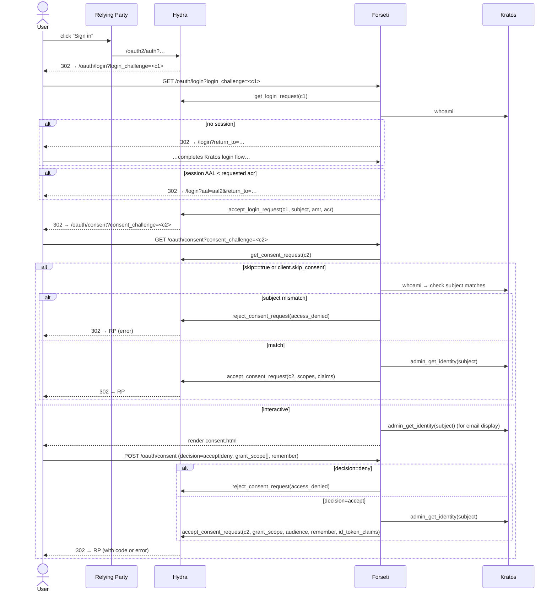
```mermaid
sequenceDiagram
    actor U as User
    participant RP as Relying Party
    participant H as Hydra
    participant P as Forseti
    participant K as Kratos
    U->>RP: click "Sign in"
    RP->>H: /oauth2/auth?…
    H-->>U: 302 → /oauth/login?login_challenge=<c1>
    U->>P: GET /oauth/login?login_challenge=<c1>
    P->>H: get_login_request(c1)
    P->>K: whoami
    alt no session
        P-->>U: 302 → /login?return_to=…
        U->>P: …completes Kratos login flow…
    end
    alt session AAL < requested acr
        P-->>U: 302 → /login?aal=aal2&return_to=…
    end
    P->>H: accept_login_request(c1, subject, amr, acr)
    H-->>U: 302 → /oauth/consent?consent_challenge=<c2>
    U->>P: GET /oauth/consent?consent_challenge=<c2>
    P->>H: get_consent_request(c2)
    alt skip==true or client.skip_consent
        P->>K: whoami → check subject matches
        alt subject mismatch
            P->>H: reject_consent_request(access_denied)
            H-->>U: 302 → RP (error)
        else match
            P->>K: admin_get_identity(subject)
            P->>H: accept_consent_request(c2, scopes, claims)
            H-->>U: 302 → RP
        end
    else interactive
        P->>K: admin_get_identity(subject) (for email display)
        P-->>U: render consent.html
        U->>P: POST /oauth/consent (decision=accept|deny, grant_scope[], remember)
        alt decision=deny
            P->>H: reject_consent_request(access_denied)
        else decision=accept
            P->>K: admin_get_identity(subject)
            P->>H: accept_consent_request(c2, grant_scope, audience, remember, id_token_claims)
        end
        H-->>U: 302 → RP (with code or error)
    end
```

Edge cases:

- Hydra `get_login_request` / `get_consent_request` failure → 302 to
  `/error`.
- CSRF failure on POST → 403 plain text.
- The form repeats `grant_scope` once per checked scope; axum's form
  extractor handles the `Vec<String>` deserialisation. Missing scopes
  (everything unchecked) → empty `grant_scope`, which Hydra accepts but
  the RP probably won't.

### MCP authorization (resource server)

MCP servers (Claude Desktop, Claude Code, claude.ai, ChatGPT) are OAuth2 public clients that delegate to Hydra; the MCP server itself is the resource server. Forseti is not in the protected-resource path — it shows up only during login + consent, exactly like any other client. What's MCP-specific is the discovery chain (RFC 9728), the audience binding (Hydra's non-standard `audience` parameter, RFC 8707 not yet in Hydra), and the per-request introspection on the MCP server.

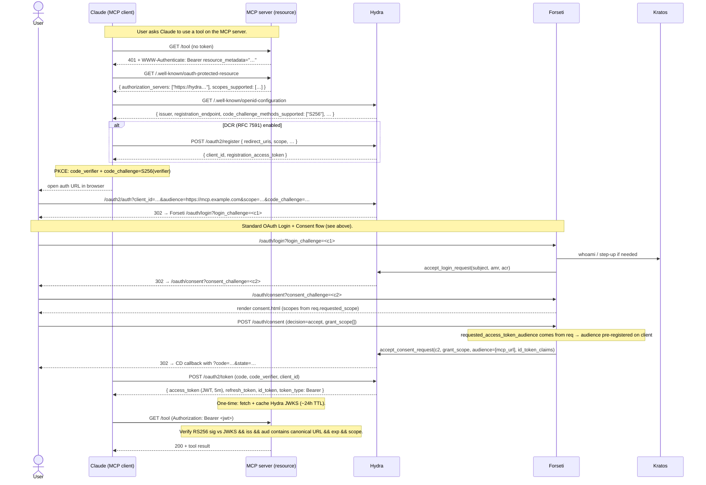
```mermaid
sequenceDiagram
    actor U as User
    participant CD as Claude (MCP client)
    participant MCP as MCP server (resource)
    participant H as Hydra
    participant P as Forseti
    participant K as Kratos

    Note over CD,MCP: User asks Claude to use a tool on the MCP server.
    CD->>MCP: GET /tool (no token)
    MCP-->>CD: 401 + WWW-Authenticate: Bearer resource_metadata="…"
    CD->>MCP: GET /.well-known/oauth-protected-resource
    MCP-->>CD: { authorization_servers: ["https://hydra…"], scopes_supported: […] }
    CD->>H: GET /.well-known/openid-configuration
    H-->>CD: { issuer, registration_endpoint, code_challenge_methods_supported: ["S256"], … }

    alt DCR (RFC 7591) enabled
        CD->>H: POST /oauth2/register { redirect_uris, scope, … }
        H-->>CD: { client_id, registration_access_token }
    end

    Note over CD: PKCE: code_verifier + code_challenge=S256(verifier)
    CD-->>U: open auth URL in browser
    U->>H: /oauth2/auth?client_id=…&audience=https://mcp.example.com&scope=…&code_challenge=…
    H-->>U: 302 → Forseti /oauth/login?login_challenge=<c1>

    Note over U,P: Standard OAuth Login + Consent flow (see above).
    U->>P: /oauth/login?login_challenge=<c1>
    P->>K: whoami / step-up if needed
    P->>H: accept_login_request(subject, amr, acr)
    H-->>U: 302 → /oauth/consent?consent_challenge=<c2>
    U->>P: /oauth/consent?consent_challenge=<c2>
    P-->>U: render consent.html (scopes from req.requested_scope)
    U->>P: POST /oauth/consent (decision=accept, grant_scope[])
    Note over P: requested_access_token_audience comes from req → audience pre-registered on client
    P->>H: accept_consent_request(c2, grant_scope, audience=[mcp_url], id_token_claims)
    H-->>U: 302 → CD callback with ?code=…&state=…

    CD->>H: POST /oauth2/token (code, code_verifier, client_id)
    H-->>CD: { access_token (JWT, 5m), refresh_token, id_token, token_type: Bearer }

    Note over MCP: One-time: fetch + cache Hydra JWKS (~24h TTL).
    CD->>MCP: GET /tool (Authorization: Bearer <jwt>)
    Note over MCP: Verify RS256 sig vs JWKS && iss && aud contains canonical URL && exp && scope.
    MCP-->>CD: 200 + tool result
```

Code references:

- Forseti's login+consent handlers are unchanged for MCP — `src/oauth/login.rs:22` and `src/oauth/consent.rs:50`. The MCP-specific part on the AS side lives in `accept_consent_request`'s `grant_access_token_audience` argument, which Forseti forwards from the consent-request's pre-registered `audience` field (`src/ory/hydra.rs:65-72`).
- The Hydra config that makes this work (PKCE enforcement, DCR, registration_endpoint exposure) is in `infra/hydra/hydra.yml`. See [`operator-guide.md#mcp-support`](../operator-guide.md#mcp-support).
- The admin UI's MCP preset (which pre-fills the right client config) lives in `src/admin/clients.rs` — `Preset::Mcp` in the preset enum (~line 45), defaults applied in `Preset::defaults()` (~line 102).

Edge cases worth knowing:

- **No `aud` binding.** If the operator forgets to add the MCP server's URL to the client's `audience` allow-list, Hydra silently drops the `audience` parameter — the issued token has no `aud` (or only Hydra's default). The MCP server must reject tokens with missing/mismatched `aud`, otherwise any Hydra-issued token works at it.
- **JWT vs opaque.** Default is JWT with a 5m TTL (`strategies.access_token: jwt`, `ttl.access_token: 5m` in `hydra.yml`) — RSes validate locally against JWKS, revocation lag is bounded to 5 minutes. Operators can flip to `opaque` for true immediate revocation, but introspection then requires admin-API reach (`/admin/oauth2/introspect` on `:4445`, **private network only**). Forseti doesn't choose; the operator does.
- **`scope` missing on auth request.** Claude Code as of mid-2025 omitted `scope` in some configurations, which Hydra refuses. Use Claude Desktop or claude.ai if you hit this — Anthropic's tracking issue is upstream.
- **No RFC 8707.** As of Hydra v26.2.0, `resource` indicators aren't supported. The `audience` query parameter is Hydra-native and bound to the pre-registered allow-list. Track [`ory/hydra` RFC 8707 issues](https://github.com/ory/hydra/issues?q=RFC+8707).

### Dynamic Client Registration (RFC 7591)

`POST /oauth2/register` — handler `register` (`src/oauth/register.rs`).
This is Forseti's thin proxy in front of Hydra's RFC 7591 endpoint.

Why Forseti is here at all: Hydra exposes `/oauth2/register` openly
once `dynamic_client_registration.enabled` is `true` — no token, no
allowlist, no CIDR gate (verified against Hydra v26.2.0
`client/handler.go`). Claude Code refuses any AS that doesn't advertise
`registration_endpoint` in its discovery document
(anthropics/claude-code#38102), so DCR has to be on. To avoid an open
endpoint in production, Forseti advertises *itself* as the
`registration_endpoint` in Hydra's webfinger
(`webfinger.oidc_discovery.client_registration_url` in
`infra/hydra/hydra.yml`), validates an Initial Access Token (IAT) on
each request, then forwards the body verbatim to Hydra.

Wire path:

1. Operator issues an IAT through `/admin/dcr-tokens/new`
   (`src/admin/dcr_tokens.rs::issue`). 32 random bytes, base64url-encoded,
   shown once via the `SecretReveal` flash pattern. Only the SHA-256 hash
   is persisted (`dcr_initial_access_tokens` table — sqlite + postgres
   migrations at `20260517000000_initial_schema`).
2. Operator hands the raw token to the client author.
3. Client author posts an RFC 7591 registration request to
   `https://forseti.example.com/oauth2/register` with
   `Authorization: Bearer <token>`.
4. Forseti:
   - Resolves the token by `sha256(token)` → row.
   - Rejects on `revoked_at`, on `expires_at <= now`, or on
     `uses_remaining <= 0` with `{"error":"invalid_token", ...}`.
   - Decrements `uses_remaining` (when non-null) inside the same
     transaction so two concurrent requests with the same single-use
     token can't both win.
   - Stamps `metadata.forseti.source = "dcr"`,
     `metadata.forseti.dcr_iat_id = <id>`, and
     `metadata.forseti.dcr_registered_at = <iso>` onto the JSON body.
     Security-relevant fields (`redirect_uris`, `grant_types`, scope)
     are passed through unchanged or the whole request is rejected —
     the proxy never rewrites the OAuth2 shape.
   - Forwards to Hydra's own `POST /oauth2/register` on the public port
     and returns Hydra's response **verbatim**. The
     `registration_access_token` Hydra returns is Hydra-validated, so
     follow-up `GET/PUT/DELETE /oauth2/register/{id}` calls bypass the
     Forseti entirely — clients hit Hydra directly. This proxy gates only
     the initial registration.
5. On success Forseti emits an
   `audit::action::OAUTH_CLIENT_DCR_REGISTERED` row capturing IAT id,
   returned `client_id`, posted `client_name` + `scope`, and a
   redirect-URI **count** (not the full list — those live on the client
   itself).

Surfacing the result downstream: the DCR proxy stamps
`metadata.forseti.verification = "unverified"` on every self-registered
client (`src/oauth/register.rs::stamp_metadata`). The consent screen
(`templates/consent.html`) reads `metadata.forseti.verification` off
`req.client.metadata` in `oauth_consent` (`src/oauth/consent.rs:50`)
and renders the **Caution** banner whenever the value is
`"unverified"`. Verified clients (admin-created, or DCR clients an
admin has explicitly vouched for via `/admin/clients/{id}/verify`)
get a subtle "Reviewed by your administrator" checkmark instead. The
admin clients list (`src/admin/clients.rs::project_row`) renders both
a "Verified" / "Unverified" pill and a separate "Self-registered" pill
on each row. Operators can revoke the IAT used (audit metadata carries
the `iat_id`), delete the client, or flip the verification state at any
time; existing access tokens issued by Hydra are unaffected by IAT or
verification changes — they're Hydra-bound.

The verify / unverify workflow lives in `src/admin/clients.rs::verify`
and `unverify`, both `POST`-only routes under `/admin/clients/{id}/...`.
Verify emits `oauth.client.verified` (INFO); unverify emits
`oauth.client.unverified` (CRITICAL). Both stamp the admin's email +
timestamp into `metadata.forseti.verified_by` / `verified_at` (or the
`*_revoked_*` pair on unverify) so the trust history travels with the
client itself, not only in the audit log.

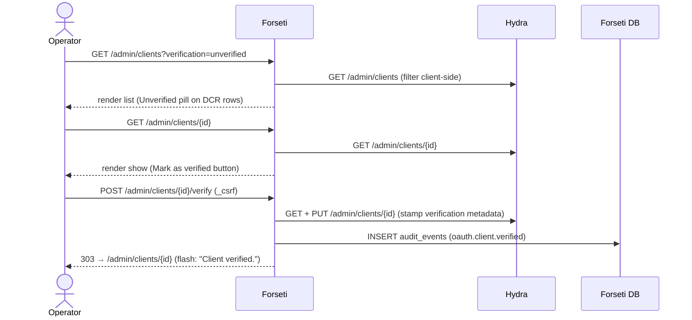
```mermaid
sequenceDiagram
    actor Op as Operator
    participant P as Forseti
    participant H as Hydra
    participant DB as Forseti DB
    Op->>P: GET /admin/clients?verification=unverified
    P->>H: GET /admin/clients (filter client-side)
    P-->>Op: render list (Unverified pill on DCR rows)
    Op->>P: GET /admin/clients/{id}
    P->>H: GET /admin/clients/{id}
    P-->>Op: render show (Mark as verified button)
    Op->>P: POST /admin/clients/{id}/verify (_csrf)
    P->>H: GET + PUT /admin/clients/{id} (stamp verification metadata)
    P->>DB: INSERT audit_events (oauth.client.verified)
    P-->>Op: 303 → /admin/clients/{id} (flash: "Client verified.")
```

```mermaid
sequenceDiagram
    actor Op as Operator
    actor C as Client author
    participant P as Forseti
    participant DB as Forseti DB
    participant H as Hydra
    Op->>P: GET /admin/dcr-tokens/new
    Op->>P: POST /admin/dcr-tokens/new (note, ttl, max_uses)
    P->>DB: INSERT dcr_initial_access_tokens (sha256(token), …)
    P->>P: flash::store_secret_reveal → reveal_token
    P-->>Op: 302 → /admin/dcr-tokens?reveal=<reveal_token>
    P-->>Op: render dcr_tokens_list.html (token shown once)
    Op->>C: out-of-band: hand over raw token
    C->>P: POST /oauth2/register {Authorization: Bearer <iat>}
    P->>DB: SELECT by sha256(iat); validate not-revoked/expired/exhausted
    alt token invalid / exhausted
        P-->>C: 401 {"error":"invalid_token"}
    else valid
        P->>DB: UPDATE uses_remaining = uses_remaining - 1 (if non-null)
        P->>P: stamp metadata.forseti.{source, dcr_iat_id, dcr_registered_at}
        P->>H: POST /oauth2/register (stamped JSON)
        H-->>P: 201 {client_id, client_secret?, registration_access_token, …}
        P->>DB: INSERT audit_events (oauth.client.dcr_registered)
        P-->>C: 201 (Hydra's body verbatim)
    end
```

Edge cases:

- **Authorization header missing / malformed scheme.** Returns 401 with
  `invalid_token`. Case-insensitive `Bearer` match per RFC 6750 §2.1.
- **Body is not a JSON object.** Returns 400 with
  `invalid_client_metadata`.
- **Hydra rejects the registration** (bad redirect URI, unsupported
  grant type, etc.). Hydra's RFC 7591 error body is passed through
  verbatim — Forseti doesn't rewrite Hydra's `error_description`.
- **Hydra unreachable.** Returns 502 with `server_error`. No client
  was created; no audit row is written.
- **Existing `metadata.forseti.*` fields posted by the client.** The
  Forseti merges its three keys (`source`, `dcr_iat_id`,
  `dcr_registered_at`) on top of whatever the client posted under
  `metadata`. Other Forseti-side fields the client tries to spoof
  (`client_type`, `account_deletion_url`) are not validated here —
  they're stamped onto the client and a malicious caller could
  pre-claim them. The admin clients page treats `metadata.forseti.source
  == "dcr"` as the trust signal, not `client_type`.

Out of scope for the MVP (tracked in `TODO_MCP.md`):

- Rate limiting (per-IP, per-token).
- TTL sweep that auto-deletes unused DCR clients.

### OAuth Client Logout (RP-initiated)

`GET /oauth/logout?logout_challenge=...` — handler `oauth_logout`
(`src/oauth/logout.rs:38`), template `templates/oauth_logout_confirm.html`.

`POST /oauth/logout` — `oauth_logout_submit` (`src/oauth/logout.rs:73`).

The GET handler used to tear down the session immediately, which meant a
malicious link could sign someone out without their interaction. It now
just validates the challenge (`hydra::get_logout_request`) and renders a
confirmation page; the actual tear-down only happens on the POST.

POST path:

1. CSRF check.
2. Best-effort Kratos session teardown — if the cookie's present, fetch
   the Kratos logout URL via `kratos::fetch_logout_url`
   (`src/ory/kratos.rs:453`) and hit it server-side. We don't follow Kratos's
   post-logout redirect because Hydra's redirect is authoritative for
   this flow.
3. `hydra::accept_logout_request` → returns the RP-specified
   post-logout URL. 302 there.

Edge cases:

- Stale / unknown `logout_challenge` → 302 to `/error` on the initial GET
  (better to surface the failure before the user clicks Sign out than
  after).
- No Kratos cookie present → skip the Kratos teardown, accept the Hydra
  challenge anyway (idempotent).
- Kratos logout failure → log and continue; Hydra's accept is still
  attempted.

## Admin Flows

Mounted at `/admin/*` from `src/app.rs` (in `build_router`) via `admin::router()`
(`src/admin/mod.rs:46`). Every handler runs through the `RequireAdmin` or
`RequireAdminScoped` extractor (`src/extractors.rs:114`, `:145`) which
delegates to `require_admin` / `require_admin_with_scope`
(`src/admin/mod.rs`) and enforces:

1. Active Kratos session — no session → 302
   `/login?return_to=<path>`.
2. Either:
   - Forseti-tier (`RequireAdmin`, or `RequireAdminScoped` with no
     `?org=`) — email is on `AppConfig.admin.allowed_emails`. Non-admin
     → 403 page (`templates/admin/forbidden.html`).
   - org-tier (`RequireAdminScoped` with `?org=<slug>`) — caller is an
     Owner of that org. Non-Default orgs additionally require the Orgs
     license feature; Locked → upsell page.
3. Session AAL is `aal2` — single-factor → 302
   `/login?aal=aal2&return_to=<path>`.

The allowlist is config-driven (not a role on the identity) — admin
membership is declared in `config.toml` and reviewable on disk. Trade-off
is a reload to change the set.

**Org-scoped admin surface.** Most admin handlers honour `?org=<slug>`
to scope their view + writes to a single org, with a 404-shape probe-
defence policy to prevent cross-org enumeration. See
[Org-scoped admin](#org-scoped-admin) under the Organizations section
for the coverage matrix, scope predicates, the per-member session
fanout pagination scheme, and the redirect-threading conventions every
new admin handler is expected to follow.

`AdminCtx` carries the admin's email (used as `actor` in audit log lines —
every handler emits a `tracing::info!(action = "admin.<area>.<verb>",
actor = …, target = …)` line) and a brand snapshot.

`GET /admin` redirects to `/admin/status` (`redirect_to_status`,
`src/admin/mod.rs:92`).

Destructive actions go through a confirm screen
(`templates/admin/confirm.html` rendered by per-area `ConfirmTemplate`
structs). The confirm page POSTs a `_csrf` token + `confirm=yes` value;
the action handler verifies both before proceeding via `ConfirmForm`
(`src/admin/mod.rs:210`).

### Clients

`/admin/clients/*` — `src/admin/clients.rs`. Hydra OAuth2 client CRUD via
the typed admin SDK.

| Route | Method | Handler | File:line |
| --- | --- | --- | --- |
| `/admin/clients` | GET | `list` | `src/admin/clients.rs:152` |
| `/admin/clients` | POST | `create` | `src/admin/clients.rs:338` |
| `/admin/clients/new` | GET | `new` | `src/admin/clients.rs:238` |
| `/admin/clients/{id}` | GET | `show` | `src/admin/clients.rs:416` |
| `/admin/clients/{id}` | POST | `update` | `src/admin/clients.rs:481` |
| `/admin/clients/{id}/rotate-secret` | GET | `rotate_confirm` | `src/admin/clients.rs:534` |
| `/admin/clients/{id}/rotate-secret` | POST | `rotate` | `src/admin/clients.rs:561` |
| `/admin/clients/{id}/delete` | GET | `delete_confirm` | `src/admin/clients.rs:613` |
| `/admin/clients/{id}/delete` | POST | `delete` | `src/admin/clients.rs:640` |

Templates: `clients_list.html`, `client_form.html`, `client_show.html`,
`confirm.html`.

Ory calls (all `hydra::*`):

- `list_clients(limit=50, page_token, filter_name)` — `src/ory/hydra.rs:124`
- `get_client(id)` — `src/ory/hydra.rs:141`
- `create_client(payload)` — `src/ory/hydra.rs:147`
- `update_client(id, payload)` — `src/ory/hydra.rs:156`
- `rotate_client_secret(id)` — `src/ory/hydra.rs:176`
- `delete_client(id)` — `src/ory/hydra.rs:166`

Edit semantics: on update, an empty form field means "leave alone"
(`parse_list` / `parse_string` in `ClientForm::to_oauth2_client`,
`src/admin/clients.rs:281`). Without this, saving the show page after
editing only the name would wipe `grant_types`, `scope`, etc.
`skip_consent` is a checkbox — absence always means "off".

Secret reveal pattern: when a client is created or its secret is rotated,
the new secret is stashed server-side via
`flash::store_secret_reveal(&db, SecretReveal)` and the redirect URL
carries only an opaque UUID-shaped token (`?reveal=<uuid>`). `show`
consumes the token with `flash::take_secret_reveal` (one-shot, atomic
DELETE) and renders the secret exactly once. Previously the secret
travelled in the redirect URL, which leaked it into browser history,
referer headers, and proxy logs.

Storage is the Forseti-owned `secret_reveals` table (`migrations/{sqlite,
postgres}/20260517000000_initial_schema`), not an in-process map — that
way a multi-instance deployment can mint on one node and reveal on
another without sticky routing. TTL is enforced application-side on
take (rows older than `REVEAL_TTL` are pruned best-effort).

Pagination on the list view is best-effort — Hydra's SDK doesn't return a
next-page token, so a full page hints at "there might be more" using the
last `client_id` as the cursor.

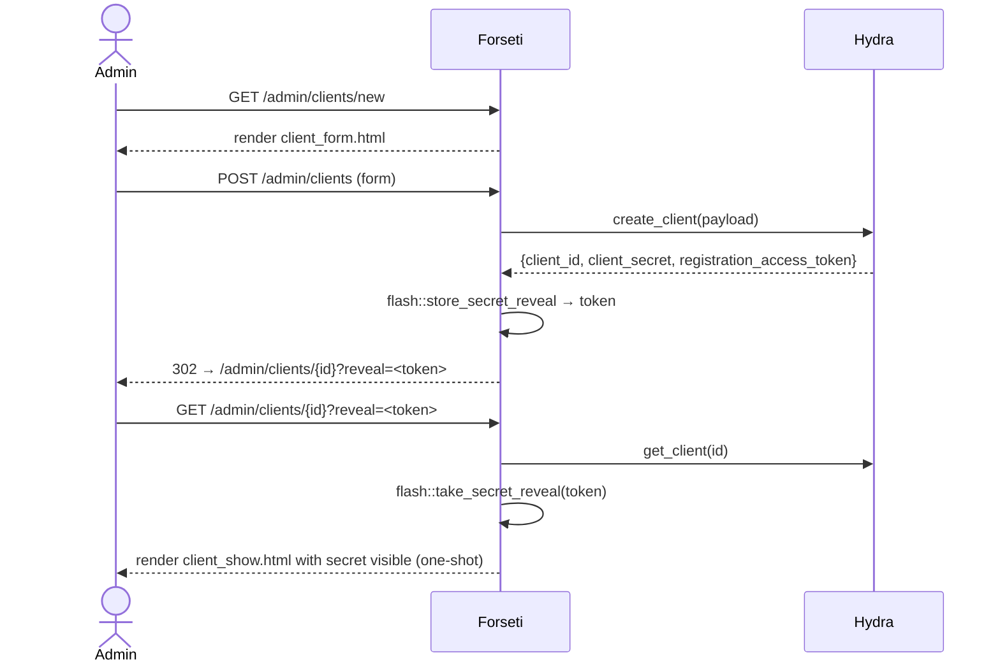
```mermaid
sequenceDiagram
    actor A as Admin
    participant P as Forseti
    participant H as Hydra
    A->>P: GET /admin/clients/new
    P-->>A: render client_form.html
    A->>P: POST /admin/clients (form)
    P->>H: create_client(payload)
    H-->>P: {client_id, client_secret, registration_access_token}
    P->>P: flash::store_secret_reveal → token
    P-->>A: 302 → /admin/clients/{id}?reveal=<token>
    A->>P: GET /admin/clients/{id}?reveal=<token>
    P->>H: get_client(id)
    P->>P: flash::take_secret_reveal(token)
    P-->>A: render client_show.html with secret visible (one-shot)
```

App templates: `GET /admin/clients/new?template=<slug>` pre-fills the form
for a known app via `seed_form_from_template`
(`src/admin/clients/handlers/create.rs:208`) — it layers app-specific
overrides (concrete `YOUR_DOMAIN/…` redirect URIs, scope, auth method,
PKCE, logout/webhook URLs) on top of the base preset, then renders the same
`client_form.html`. The chosen template is not persisted; `client_type`
still stamps the base preset slug into client metadata. An unknown slug
redirects back to `/admin/clients/new` (the picker) rather than rendering a
half-filled form. The picker's "Popular apps" group is built from
`app_template_cards()` (`src/admin/clients/app_templates.rs`).

Connection-details card: `client_show.html` shows the issuer + OIDC
endpoints the integrator needs for the other end, sourced from
`AppState::openid_configuration()` (`src/state.rs:75`), which fetches Hydra's
`/.well-known/openid-configuration` via `ory::discovery::fetch`
(`src/ory/discovery.rs`) and caches it with a TTL. On a cold fetch failure
the resolver returns an empty doc + `discovery_ok = false`; the card's
per-row `is_empty()` guards then hide every endpoint, so a wrong issuer is
never shown — the operator sees a "couldn't reach Hydra" note plus the
non-endpoint client values.

### Identities

`/admin/identities/*` — `src/admin/identities.rs`. Kratos identity browser.

| Route | Method | Handler | File:line |
| --- | --- | --- | --- |
| `/admin/identities` | GET | `list` | `src/admin/identities.rs:170` |
| `/admin/identities/{id}` | GET | `show` | `src/admin/identities.rs:275` |
| `/admin/identities/{id}/recovery` | POST | `recovery` | `src/admin/identities.rs:416` |
| `/admin/identities/{id}/disable` | GET | `disable_confirm` | `src/admin/identities.rs:462` |
| `/admin/identities/{id}/disable` | POST | `disable` | `src/admin/identities.rs:489` |
| `/admin/identities/{id}/enable` | POST | `enable` | `src/admin/identities.rs:544` |
| `/admin/identities/{id}/delete` | GET | `delete_confirm` | `src/admin/identities.rs:592` |
| `/admin/identities/{id}/delete` | POST | `delete` | `src/admin/identities.rs:619` |

Templates: `identities_list.html`, `identity_show.html`, `confirm.html`.

Ory calls (all `kratos::*`):

- `list_identities(limit=50, page_token, filter_email)` — `src/ory/kratos.rs:288`
- `admin_get_identity_full(id)` — `src/ory/kratos.rs:314`
- `list_identity_sessions(id)` — `src/ory/kratos.rs:264` (per-identity, surfaced
  in the show view)
- `admin_create_recovery_code(id)` — `src/ory/kratos.rs:367`
- `admin_update_identity_state(id, Active|Inactive)` — `src/ory/kratos.rs:334`
- `admin_delete_identity(id)` — `src/ory/kratos.rs:358`

The show view aggregates: traits (pretty-printed JSON), enrolled
credentials (`password`, `oidc`, `totp`, `webauthn`, `lookup_secret` —
one row per method with its `identifiers`), verifiable addresses
(email + verified flag), and the identity's active sessions.

Recovery code generation produces a one-shot reveal: same
`SecretReveal` token pattern as client secrets. `?reveal=<token>` is
consumed by the show view to display the plaintext code + recovery link
exactly once.

Identity state is a tri-state in Kratos (`active` / `inactive` / `null`);
the row projection treats `null` as `active` (`project_row` in
`src/admin/identities.rs`) so identities created via APIs that omit
the field don't render with an empty badge.

Disabling does **not** revoke existing sessions — the confirm copy makes
this explicit. Admin must follow up via `/admin/sessions` if desired.

Flash cookies carry per-action banners ("Identity disabled." / "Identity
enabled.") scoped to the identity's show path.

### Sessions

`/admin/sessions` — `src/admin/sessions.rs`. Global session list across all
identities, plus per-session revoke.

| Route | Method | Handler | File:line |
| --- | --- | --- | --- |
| `/admin/sessions` | GET | `list` | `src/admin/sessions.rs:76` |
| `/admin/sessions/{id}/revoke` | GET | `revoke_confirm` | `src/admin/sessions.rs:176` |
| `/admin/sessions/{id}/revoke` | POST | `revoke` | `src/admin/sessions.rs:203` |

Templates: `sessions_list.html`, `confirm.html`.

Ory calls:

- `kratos::admin_list_all_sessions(limit=100, page_token, active_only)` —
  `src/ory/kratos.rs:383`
- `kratos::admin_revoke_session(id)` — `src/ory/kratos.rs:403`

`?active_only=1|true|on` toggles the filter passed to Kratos. Each row
projects identity email, device user-agent / IP, authenticated_at,
expires_at. Revoke flow is the standard confirm screen → POST → flash
banner ("Session revoked.").

Note the confirm copy: "If this is your own session you'll be signed out."
The admin's own session lives in the same list and can be revoked.

### Audit Log

`/admin/audit` — `src/admin/audit.rs`. Queries the append-only
`audit_events` table populated by `src/audit/mod.rs`. Replaces the prior
session-scrape stand-in entirely.

| Route | Method | Handler | File:line |
| --- | --- | --- | --- |
| `/admin/audit` | GET | `show` | `src/admin/audit.rs:32` |

**Schema** (`migrations/{sqlite,postgres}/20260517000000_initial_schema/up.sql`):
one table with explicit actor (`actor_kind` / `actor_id` / `actor_email`),
target (`target_kind` / `target_id`), org-id forward-compat column,
context (`ip_hash` / `user_agent` / `request_id`), severity, success
flag, and a JSON `metadata` blob. Indexes on `(created_at)`,
`(actor_id, created_at)`, `(action, created_at)`, `(target_kind,
target_id, created_at)`.

**Append-only enforcement.** A BEFORE UPDATE OR DELETE trigger refuses
modifications unless the pruner has set the backend-specific override
inside the same transaction:

- Postgres: `current_setting('app.audit_purge', true) = 'true'`
- Sqlite: sentinel row in `_forseti_meta(key='audit_purge_lock')`

The Rust wrapper `audit::prune_older_than` (`src/audit/mod.rs`) is the
only legitimate writer of UPDATE/DELETE. A crash mid-prune rolls the
override back atomically — no boot-time reset needed.

**Three event sources** (see `src/audit/mod.rs` module doc):

1. **Forseti handlers** call `audit::log(&state.db, AuditEvent::new(...))`
   directly. ~15 sites across `src/admin/`, `src/auth/logout.rs`,
   `src/settings/{account,sessions}.rs`, `src/oauth/consent.rs`.
2. **Kratos flow hooks** POST to `/internal/audit/kratos` on the
   **internal listener** (`[internal].bind`, defaults to
   `127.0.0.1:8081`) — handler at `src/audit/kratos_webhook.rs`. The
   internal listener is a second `axum::serve` spawned from
   `src/app.rs::run`, sharing `AppState` with the public listener.
   Per-hook action is selected via the `?action=...` query parameter
   on the webhook URL so one shared `infra/kratos/audit_event.jsonnet`
   template covers every flow. Bearer-token auth against
   `[audit].webhook_token` (mandatory — Forseti refuses to boot
   when this is empty).
3. **Hydra consent** is emitted from `src/oauth/consent.rs` directly
   (Hydra has thin hook surface; emitting from Forseti's own handler
   gives full context without scraping).

Filters (query string):

- `email` — substring match against `actor_email`, applied client-side
  after the SQL fetch (no substring index on the column).
- `action` — prefix match (`admin.` → `LIKE 'admin.%'`). The
  `AuditFilter` struct also exposes `action_exact` for the typed API.
- `severity` — exact match: `info` / `warning` / `error` / `critical`.
- `since` — RFC3339 timestamp; accepts `<input type="datetime-local">`
  shapes too. Lexicographic order matches chronological order for RFC3339
  strings, so the SQL `>=` comparison sorts correctly. Unparseable
  values surface an inline error banner.

Rows are sorted newest-first by `created_at`. Limit clamped to `[1, 200]`.

**Retention.** `audit::prune_older_than(days)` runs from the CLI
subcommand `forseti audit-prune` (hand-rolled dispatch in `src/main.rs`).
Reads `[audit].audit_retention_days` (default 90). Not auto-run inside
the HTTP server; operators schedule via cron / systemd timer.

**Metadata discipline.** `AuditEvent::metadata` accepts only
`SafeMetadata`, constructed via the `audit_metadata!` macro or
`SafeMetadata::from_pairs`. Both apply a deny-list against
`(?i)(password|secret|token|cookie|authorization|otp|recovery)` keys —
debug builds panic, release builds drop the key and `warn!`-log.

### Status

`/admin/status` — `src/admin/status.rs`. System health dashboard.

| Route | Method | Handler | File:line |
| --- | --- | --- | --- |
| `/admin/status` | GET | `show` | `src/admin/status.rs:44` |

Probes (every one is best-effort — a failure renders that row as "down"
with the error text in the detail column, without aborting the page):

- `kratos::health_alive` (`src/ory/kratos.rs:430`)
- `kratos::health_ready` (`src/ory/kratos.rs:436`)
- `hydra::health_alive` (`src/ory/hydra.rs:189`)
- `hydra::health_ready` (`src/ory/hydra.rs:193`)

Plus:

- `kratos::list_courier_messages(limit=100, Queued)` → pending count
- `kratos::list_courier_messages(limit=100, Abandoned)` → failed count
- `kratos::version` / `hydra::version`
- Forseti version from `env!("CARGO_PKG_VERSION")` (constant
  `FORSETI_VERSION`, `src/web.rs`)

Read-only — no CSRF token needed; `csrf_token` is rendered as an empty
string.

## Dashboard

`GET /` — handler `root` (`src/dashboard.rs:69`), template
`templates/dashboard.html`. Post-login landing page.

Flow:

1. `kratos::whoami` — no session → 302 `/login`.
2. `build_activity_feed(state, session)` (`src/dashboard.rs:109`) calls
   `kratos::list_identity_sessions(identity_id)` and folds the 5 most
   recent into the Recent Activity sidebar. Each session becomes a
   "Successful sign-in" row with `ip · user-agent` detail and the
   `authenticated_at` timestamp. Failures here are non-fatal — the
   sidebar renders an empty-state fallback if the API call fails.
3. `session_needs_verification(session)` (`src/flow_view.rs:523`) drives a
   verification banner at the top of the page when any verifiable
   address on the identity is still unverified. Banner links to
   `/verification`.

The dashboard also renders:

- **Your Apps** — the `apps` list from `AppConfig.apps` (operator-curated
  app launchers). Section is hidden when the list is empty.
- **Quick Actions** — fixed links to `/settings/profile` and
  `/settings/password`.
- **Recent Activity** — sidebar described above.

CSRF cookie is issued here (needed for the logout form in the base
layout's nav).

Edge case: `whoami` errors (Kratos unreachable) are logged and treated as
no-session, sending the user to `/login` rather than rendering a half-
broken dashboard.

---

## Organizations

Forseti carries a real `organizations` table (seeded with one "Default" row by migration `20260517000000_initial_schema`). Every code path queries through the same shape regardless of whether the operator runs OSS or commercial — the multi-org dropdown is just longer on commercial.

Two scopes coexist on the routes:

- `/settings/organization{,/branding,/members}` — singular, Default-org-only. OSS surface; no license gate.
- `/settings/organizations{,/{slug},/{slug}/branding,/{slug}/members,/{slug}/delete}` — plural, multi-org. License-gated for non-Default orgs.

Module entry points:

- `crate::orgs::settings_page::router` (`src/orgs/settings_page.rs`) — page handlers
- `crate::orgs::invite::router` (`src/orgs/invite.rs`) — invite + accept
- `crate::orgs::cookie` (`src/orgs/cookie.rs`) — signed `active_org` cookie
- `crate::orgs::db` (`src/orgs/db.rs`) — diesel queries

### Auto-join on first authenticated request

Default-org membership is established **lazily**, on the user's first authenticated request after registration — not via a Kratos webhook. The probe runs inside `crate::extractors::RequireSession` (`src/extractors.rs`); it fires once per request (cached in request extensions via a `AutoJoinChecked` sentinel) regardless of how many handlers extract the session.

Flow inside `RequireSession::from_request_parts`:

1. Resolve the session through `ory::kratos::whoami`.
2. If `identity_id` is non-empty and the per-request sentinel is unset, call `crate::orgs::ensure_default_membership(&db, &cfg, identity_id, email)` (`src/orgs/mod.rs`).
3. `ensure_default_membership` runs a cheap indexed probe `crate::orgs::db::has_any_membership(db, identity_id)` (`src/orgs/db.rs`). On a hit it returns immediately. On a miss it calls the race-safe `auto_join_default_txn` (`src/orgs/db.rs`).
4. Transient DB errors are logged at `warn!` and **swallowed** — the user can still see Forseti; the next request retries the auto-join. Auth never breaks because the orgs table is temporarily slow.

Role policy (unchanged, lives in `pick_default_role` in `src/orgs/mod.rs`):

- First user on a fresh install (Default org has zero members at txn-start) → `owner` of Default.
- Email in `admin.allowed_emails` (case-insensitive) → `owner` of Default.
- Otherwise → `member` of Default.

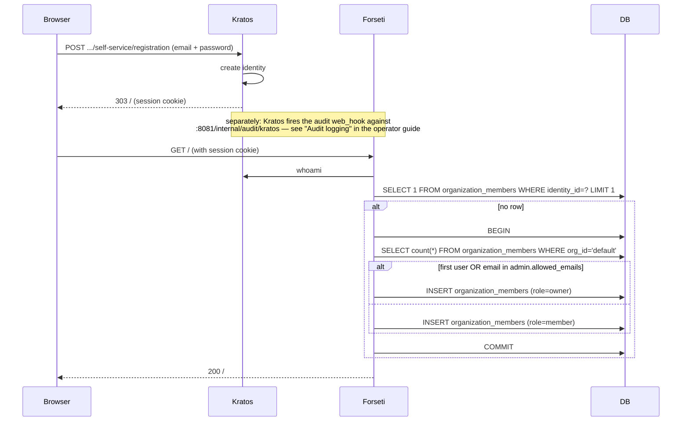
```mermaid
sequenceDiagram
    participant Browser
    participant Kratos
    participant Forseti
    participant DB
    Browser->>Kratos: POST .../self-service/registration (email + password)
    Kratos->>Kratos: create identity
    Kratos-->>Browser: 303 / (session cookie)
    Note over Kratos,Forseti: separately: Kratos fires the audit web_hook against<br/>:8081/internal/audit/kratos — see "Audit logging" in the operator guide
    Browser->>Forseti: GET / (with session cookie)
    Forseti->>Kratos: whoami
    Forseti->>DB: SELECT 1 FROM organization_members WHERE identity_id=? LIMIT 1
    alt no row
        Forseti->>DB: BEGIN
        Forseti->>DB: SELECT count(*) FROM organization_members WHERE org_id='default'
        alt first user OR email in admin.allowed_emails
            Forseti->>DB: INSERT organization_members (role=owner)
        else
            Forseti->>DB: INSERT organization_members (role=member)
        end
        Forseti->>DB: COMMIT
    end
    Forseti-->>Browser: 200 /
```

### Active-org switching

The signed `forseti_active_org` cookie (`src/orgs/cookie.rs`) carries the user's currently selected org id. Format: `<unix_seconds>.<hex_id>.<hex_mac>`. HMAC key derives from `sha256(b"forseti::active_org::v1" || self.url)` — distinct from the flash key, so neither cookie can be replayed against the other.

`crate::orgs::active_org(db, portal_url, headers, identity_id)` reads the cookie, cross-checks it against the user's `organization_members` rows, and falls back to the first membership when the cookie is missing or names an org the user isn't in.

`POST /orgs/switch` (`src/orgs/settings_page.rs::switch_active_org`) accepts an `org_id` + CSRF, verifies membership, and writes the cookie before 303-ing back to `return_to`.

### Members page

`GET /settings/organization/members` — handler `default_members` (`src/orgs/settings_page.rs`).

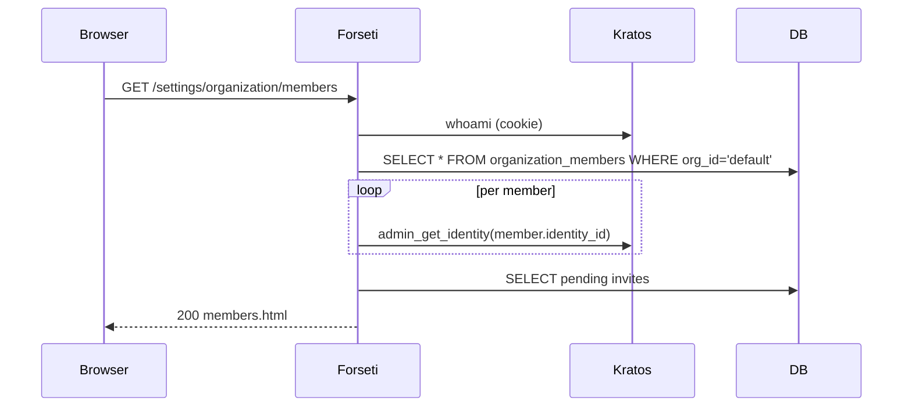
```mermaid
sequenceDiagram
    participant Browser
    participant Forseti
    participant Kratos
    participant DB
    Browser->>Forseti: GET /settings/organization/members
    Forseti->>Kratos: whoami (cookie)
    Forseti->>DB: SELECT * FROM organization_members WHERE org_id='default'
    loop per member
        Forseti->>Kratos: admin_get_identity(member.identity_id)
    end
    Forseti->>DB: SELECT pending invites
    Forseti-->>Browser: 200 members.html
```

Owners can update roles (`POST .../members/{id}/role`) and remove members (`POST .../members/{id}/remove`). The remove handler refuses when the target is the last owner — the org would become ungovernable.

### Invite + accept

`POST /settings/organization/members/invite` (singular) or `POST /settings/organizations/{slug}/members/invite` (plural) — handler in `src/orgs/invite.rs::post_invite_for`.

Token shape: a 24-byte hex random, stored in `organization_invites` with `{ org_id, email, role, expires_at, accepted_at }`. Default TTL 7 days.

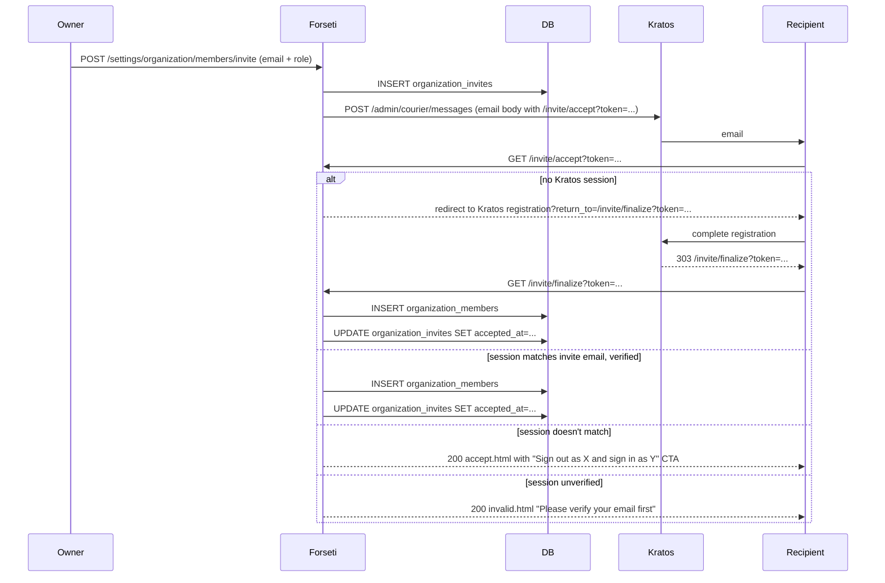
```mermaid
sequenceDiagram
    participant Owner
    participant Forseti
    participant DB
    participant Kratos
    participant Recipient
    Owner->>Forseti: POST /settings/organization/members/invite (email + role)
    Forseti->>DB: INSERT organization_invites
    Forseti->>Kratos: POST /admin/courier/messages (email body with /invite/accept?token=...)
    Kratos->>Recipient: email
    Recipient->>Forseti: GET /invite/accept?token=...
    alt no Kratos session
        Forseti-->>Recipient: redirect to Kratos registration?return_to=/invite/finalize?token=...
        Recipient->>Kratos: complete registration
        Kratos-->>Recipient: 303 /invite/finalize?token=...
        Recipient->>Forseti: GET /invite/finalize?token=...
        Forseti->>DB: INSERT organization_members
        Forseti->>DB: UPDATE organization_invites SET accepted_at=...
    else session matches invite email, verified
        Forseti->>DB: INSERT organization_members
        Forseti->>DB: UPDATE organization_invites SET accepted_at=...
    else session doesn't match
        Forseti-->>Recipient: 200 accept.html with "Sign out as X and sign in as Y" CTA
    else session unverified
        Forseti-->>Recipient: 200 invalid.html "Please verify your email first"
    end
```

`/invite/accept` refuses to write a membership row for an identity whose verifiable address (matching the invite email) is unverified — mitigation #3 in the unverified-email squatting story.

### Claim-email flow

When registration would conflict with an existing unverified identity, the user can navigate to `/claim-email` (`src/identity/claim_email.rs`) and reclaim the address:

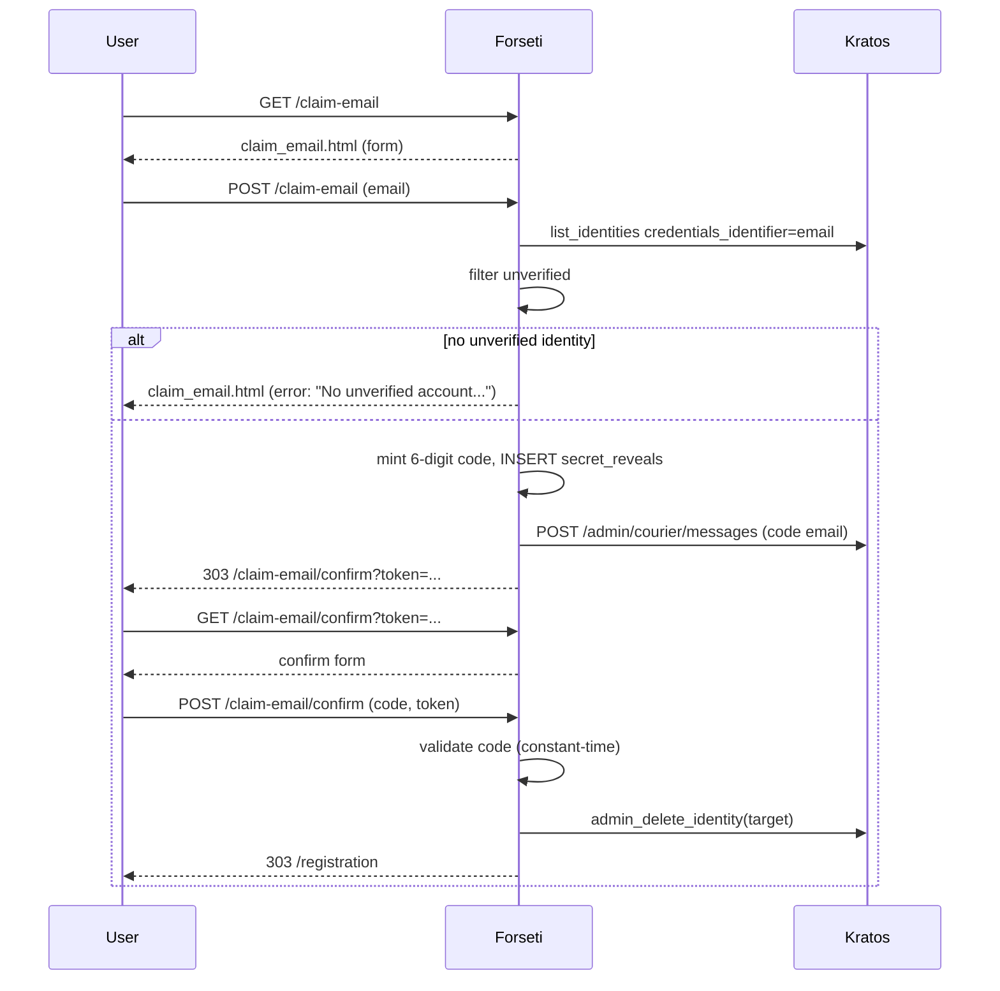
```mermaid
sequenceDiagram
    participant User
    participant Forseti
    participant Kratos
    User->>Forseti: GET /claim-email
    Forseti-->>User: claim_email.html (form)
    User->>Forseti: POST /claim-email (email)
    Forseti->>Kratos: list_identities credentials_identifier=email
    Forseti->>Forseti: filter unverified
    alt no unverified identity
        Forseti-->>User: claim_email.html (error: "No unverified account...")
    else
        Forseti->>Forseti: mint 6-digit code, INSERT secret_reveals
        Forseti->>Kratos: POST /admin/courier/messages (code email)
        Forseti-->>User: 303 /claim-email/confirm?token=...
        User->>Forseti: GET /claim-email/confirm?token=...
        Forseti-->>User: confirm form
        User->>Forseti: POST /claim-email/confirm (code, token)
        Forseti->>Forseti: validate code (constant-time)
        Forseti->>Kratos: admin_delete_identity(target)
        Forseti-->>User: 303 /registration
    end
```

The reveal row is consumed on first read (`flash::take_secret_reveal`); a stale token returns the "code expired" error.

### Org-scoped admin

The `?org=<slug>` query-string convention lets org owners reach the admin surface without the Forseti-wide allowlist. The admin surface is **hybrid**:

- Missing `?org=` → Forseti-tier (gated by `admin.allowed_emails` in `config.toml`).
- Present `?org=<slug>` → org-scoped (caller must be an Owner of that org). Non-Default orgs additionally require the Orgs feature on the active license; a `Locked` status renders the upsell page.

The gate runs via the `RequireAdminScoped` extractor (`src/extractors.rs:145`), which parses `?org=` directly from the request URI and delegates to `require_admin_with_scope` (`src/admin/mod.rs:141`). Forseti-tier-only handlers use `RequireAdmin` (no `?org=` parsing).

#### Coverage matrix

| Surface | `?org=` honoured | Scope predicate | Notes |
|---|---|---|---|
| `/admin/clients/*` | yes | `ensure_client_in_scope` (`src/admin/clients/scope.rs:34`) — joins Hydra client → `oauth_client_metadata.org_id` | Orphan rows (no metadata) default to Default and are invisible to org-scoped views. Create POST stamps the new client's `org_id` to the scoped org; Forseti-scope reads the admin's active-org cookie via `crate::orgs::active_org` and falls back to Default. |
| `/admin/identities/*` | yes | `require_identity_in_scope` (`src/admin/identities.rs`) — `crate::orgs::is_member(identity_id, scope_org)` | List page paginates org members via `list_members_paged` (25/page) then bulk-fetches the matching Kratos identities. Detail/recovery/disable/enable/delete all gated. |
| `/admin/sessions/*` | yes | `require_session_in_scope` (`src/admin/sessions.rs`) — fetches session via `admin_get_session`, checks `is_member` on its owning identity | List paginates **by org members**, not by sessions — see "Per-member session fanout" below. Revoke verifies scope ownership before calling `admin_revoke_session`. |
| `/admin/webhooks/*` | yes | `webhook_row_in_scope` (`src/admin/webhooks.rs`) — joins outbox row → `oauth_client_metadata.org_id` of the row's `client_id` | Dead-letter list filtered server-side after the SELECT. `show_one` / `requeue` / `discard` all re-check. |
| `/admin/audit/{event_id}` | yes | direct compare against the row's `org_id` column | Row tagged via `.org(...)` on the originating `AuditEvent`. Untagged rows are invisible to org-scoped views by design (the gap noted in the audit log section). |
| `/admin/audit` (list) | yes | filter pushed into SQL via `AuditFilter.org_id` | Each row's `org_id` matched at query time. |
| `/admin/status` | no (Forseti-tier-only) | — | Cluster-wide health probe; no org dimension. |
| `/admin/dcr-tokens/*` | no (Forseti-tier-only) | — | `dcr_initial_access_tokens` schema has no `org_id` column — an IAT can mint into any org based on the registrant's `?org=` at `/oauth2/register`. Forseti-tier-only by intent; documented in the module doc at `src/admin/dcr_tokens.rs`. |

#### 404-shape probe defence

Every scope predicate renders a 404-shape error ("not found in this organization") rather than a 403 ("forbidden") when the target ID exists but belongs to a sibling org. Reason: a 403 leaks the existence of a sibling-org resource to an org-scoped admin, who could URL-fish for client/identity/session/webhook IDs across the tenant boundary. The 404-shape policy makes cross-org enumeration indistinguishable from "doesn't exist."

New admin handlers MUST follow this policy. If you find yourself rendering a friendlier 403, you're leaking.

#### Per-member session fanout

`/admin/sessions?org=acme` doesn't use Kratos's opaque `page_token` — Kratos has no per-org filter on the session list. Instead the handler pages through org members via `list_members_paged(SESSIONS_ORG_PAGE_SIZE = 25, offset)` then sequentially calls `kratos::list_identity_sessions(identity_id)` for each, flattening the results. Pagination is a numeric member offset, not a session token. Trade-offs:

- **Bounded**: at most 25 admin API calls per page request — proportional to member count, independent of session-per-member fanout.
- **Sequential**: not concurrent. p95 page render scales with the slowest of those 25 Kratos round-trips. Acceptable for an admin surface; a follow-up could switch to `JoinSet` for parity with `admin/webhooks.rs::resolve_client_names`.
- **No active-only filter at the source**: `active_only=1` is applied in-memory after the fanout, not pushed down. Kratos's `list_identity_sessions` doesn't expose the `active` filter the global `list_sessions` does.

Forseti-tier (`?org=` absent) still uses `admin_list_all_sessions` with Kratos's native pagination.

#### Redirect threading

Org-scoped handlers MUST thread `?org=<slug>` through every redirect they emit, otherwise the user bounces to a Forseti-tier view they can't access and lands back at the org-tier 403 / login screen. Helpers exist:

- `src/admin/sessions.rs::with_org(base, org)`
- `src/admin/identities.rs::with_org(base, org)`
- `src/admin/webhooks.rs::with_org(base, scope)`
- `src/admin/clients/scope.rs::with_org_param(base, scope)`

These are deliberately duplicated rather than centralised — each surface has slightly different scope-extraction shapes (`Option<&str>` vs `&AdminScope`) and centralising would force a single signature on all four. Worth revisiting if a fifth surface appears.

#### Hydra clients per-org

Hydra's `oauth2_clients` table is unchanged — `org_id` lives Forseti-side in `oauth_client_metadata`. The list view fetches a page from Hydra, joins our metadata in memory, and post-filters. v1 shortcut: post-filtering after Hydra paginates can shrink a page below `CLIENTS_PAGE_SIZE`, so an org with sparse clients spread across Hydra's ordering may need multiple "Next page" clicks to reach all its rows. A Forseti-owned client mirror would lift this; not on the roadmap until list sizes warrant it.

DCR-registered clients (`POST /oauth2/register`) default to Default. When the request happens to carry a valid Forseti session cookie, the new client is attributed to that caller's active org instead — uncommon path (Claude / Code can't carry Forseti cookies), but useful for scripted dev flows.

### Create org

`POST /settings/organizations/create` (`src/orgs/settings_page.rs::orgs_create`) is the first call site of the license gate end-to-end:

1. CSRF check.
2. `state.license.feature(Feature::Orgs)` — Locked → render upsell.
3. `state.license.status().license().limits.max_orgs.under(current)` — quota check; over-cap → render upsell.
4. Slug auto-derive via `slugify(name)` with `-2`, `-3`, ... suffixes on collision.
5. INSERT org + owner-role membership for the creator.

### OIDC `org` / `orgs` claims

`build_id_token_claims` in `src/oauth/consent.rs:494` folds the user's memberships into the id_token when the granted scope contains `org` (active org as `{ id, slug, role, name }`) or `orgs` (the full membership list, capped at `crate::orgs::nav::ORGS_CLAIM_CAP` = 32).

`finalize_consent` resolves the active org as the first membership (the consent runs out-of-band from the browser request, so the active-org cookie isn't available — first-membership is the pragmatic fallback).

### `organization_id=<id>` auth-request parameter

Downstream apps that want to pin a specific org on a re-authentication include `organization_id=<id>` on `/oauth2/auth`. Hydra surfaces the full original URL verbatim on `oauth2_login_request.request_url`; `crate::oauth::login::parse_organization_id_param` (`src/oauth/login.rs`) extracts it.

When the user is a member of the named org, Forseti writes the active-org cookie before accepting the login challenge. When they're not a member, the param is silently ignored (per spec — no error UX).

## Unverified-account reaper

`forseti unverified-prune` (`src/identity/mod.rs::prune_unverified_cli`) walks Kratos's identity list and deletes anyone with at least one unverified verifiable address AND `created_at < now - identity.unverified_ttl_days` (default 7).

CLI dispatch lives in `src/main.rs` next to `audit-prune`:

```
forseti unverified-prune
```

Strongly recommended as a cron (see `docs/operator-guide.md`). The reaper is one half of the unverified-email-squatting mitigation; the claim-email + invite-verified-only paths are the other halves.
